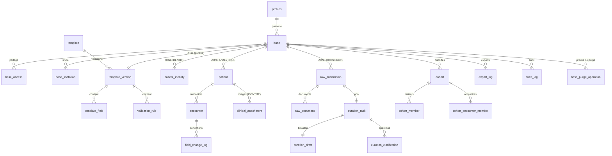
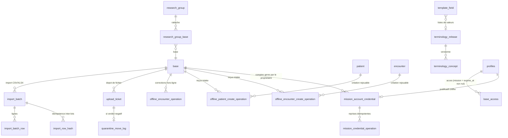

# Architecture — Registre clinique (v4.0)

> Vue d'ensemble pour un nouveau développeur. Décrit le **modèle de données**, les
> **rôles**, le **cloisonnement de sécurité (RLS)**, le **cycle de curation** et les
> **sous-systèmes serveur** tels qu'ils sont réellement implémentés aujourd'hui. Pour la mise en
> route locale, voir [tester-en-local.md](tester-en-local.md) et
> [configurer-supabase.md](configurer-supabase.md).
>
> **Relecteur extérieur ?** [guide-relecture-externe.md](guide-relecture-externe.md) propose un
> parcours développeur et un parcours sécurité. L'index de toute la documentation est dans
> [README.md](README.md).

**Instantané vérifié le 24 août 2026** (`npm run db:verify` : les 132 migrations rejouées
proprement depuis zéro en ~10 s ; décomptes du schéma `public` repris de
[schema-etat-final.md](schema-etat-final.md), qui est **généré** et fait foi) :
43 tables · 269 fonctions · 63 politiques RLS · 66 triggers · 8 Edge Functions · ~21 200 lignes de
TypeScript applicatif (hors tests) · ~19 400 lignes de SQL de migration.

Spécifications de référence (reconstituées à partir du code réel, versionnées) :
**[cahier-des-charges-metier.md](cahier-des-charges-metier.md)** (fonctionnel : EF / RG) et
**[cahier-des-charges-technique.md](cahier-des-charges-technique.md)** (technique : ET). Les
références `§X.Y` dans les commentaires du code renvoient au cahier d'origine ; ce fichier-ci
en reste la **vue d'ensemble développeur**.

---

## 1. Principe central : un registre, trois zones

Le produit est **registre-centré** : l'objet central est le **patient**, pas l'étude.
Toute la sécurité repose sur le **cloisonnement de trois zones**, appliqué **côté base de
données** par Row-Level Security (RLS) — pas seulement dans l'interface.

| Zone | Tables | Contenu | Qui y accède | Exportable ? |
|---|---|---|---|---|
| **Identité** (restreinte) | `patient_identity`, `clinical_attachment` | Nom, date de naissance exacte, images cliniques | `can_view_identity` uniquement | **Jamais** |
| **Analytique** | `patient`, `encounter`, `field_change_log` | Données structurées, **âge calculé** (pas la DOB) | Selon permissions de base | Oui (sans identité) |
| **Documents bruts** (restreinte) | `raw_submission`, `raw_document` + sous-système curation | Documents source dé-identifiés à structurer | `can_view_raw_documents` / curateur affecté | **Jamais** |

**Règles non négociables :**
- Aucune donnée identifiante ni image n'apparaît dans un export.
- `patient_identity` et `patient` sont **deux tables sans clé étrangère** entre elles ;
  le seul lien est la paire `(base_id, patient_code)`.
- La **date de naissance exacte ne quitte jamais** la zone identité : l'âge est calculé
  côté serveur (`compute_age`, SECURITY DEFINER) et seul l'âge entre en zone analytique.
- La clé `service_role` de Supabase n'apparaît **jamais** dans le frontend (seules les
  variables `VITE_*` sont injectées dans le bundle).
- Données **entièrement fictives** uniquement.

---

## 2. Rôles & permissions

### 2.1 Rôle global (`profiles.global_role`) — 4 valeurs

| Rôle | Description | Accès aux données patient |
|---|---|---|
| `system_admin` | Gère les gabarits globaux et les comptes | **Aucun** |
| `medecin` | Crée et possède des bases, saisit, exporte | Ses bases + bases partagées |
| `curateur` | Structure et **finalise** les cas du pool de curation | Documents bruts des cas réservés ; **jamais l'identité** |
| `saisisseur` | **Compte de mission** : saisit sur une seule base, pour une durée bornée | Saisie seule ; jamais d'export ni de documents bruts |

> Les anciens rôles `analyste` et `validateur` ont été supprimés. Le **curateur**
> structure ET finalise seul (il n'y a plus d'étape de validation séparée).

**Pourquoi `saisisseur` est un rôle global et non une simple permission de base** — la question
revient toujours en revue. Le rôle `medecin` porte des droits **hors de toute base** : créer une
base ([`20260616090400_rls.sql:68`](../supabase/migrations/20260616090400_rls.sql)), créer un
gabarit, accepter une invitation. Aucune permission de `base_access` ne peut les retirer : un
étudiant déclaré `medecin` pourrait créer sa propre base et y recopier les données hors du
contrôle de son directeur. En faisant du saisisseur un rôle distinct, toute policy écrite
`is_medecin() and …` — y compris celles écrites **plus tard** — l'exclut automatiquement : le
défaut échoue fermé. Spécification : [spec-comptes-mission.md](spec-comptes-mission.md).

Invariants d'une mission, portés **par trigger** (`guard_base_access_medecin`, donc valables quelle
que soit la voie d'écriture) : échéance obligatoire ≤ 24 mois, `can_create_structured_data`
obligatoire, `can_edit_structured_data` / `can_export_data` / `can_manage_access` /
`can_view_raw_documents` interdites, justification écrite exigée si l'identité est ouverte.
L'échéance, la révocation et la génération courante du justificatif sont revérifiées par RLS **à
chaque requête**. Un jeton émis avant une révocation ou une régénération ne survit donc pas à
l'opération.

### 2.2 Rôle d'accès par base (`base_access.access_role`) — 2 valeurs

Le partage de base se fait entre médecins :

| Rôle d'accès | Permissions par défaut proposées |
|---|---|
| `viewer` | Lecture seule (aucune permission cochée par défaut) |
| `editor` | `can_view_identity` + `can_view_raw_documents` + `can_edit_structured_data` |

### 2.3 Les 6 permissions granulaires (`base_access` / `base_invitation`)

`can_view_identity`, `can_view_raw_documents`, `can_create_structured_data`,
`can_edit_structured_data`, `can_export_data`, `can_manage_access`.

`can_create_structured_data` (ajoutée par les comptes de mission) sépare **créer** de
**modifier** : les RPC de création acceptent `can_create` **ou** `can_edit` — aucun backfill,
aucun changement pour les éditeurs existants — tandis que les RPC de modification exigent
`can_edit` seul. Un saisisseur crée et soumet, mais ne corrige jamais une donnée soumise.

Le **propriétaire** d'une base les possède toutes. Pour un collaborateur, chaque
permission est un booléen indépendant, vérifié côté base par une fonction d'aide
(`can_view_identity(base)`, `can_export_data(base)`, …). Une invitation ne stocke que le
**hash** du jeton (`token_hash`) ; le jeton en clair n'est montré qu'une fois.

Noter que `can_write_identity(base)` n'est **pas** une colonne mais une fonction dérivée :
elle exige `is_medecin()` **et** (propriétaire **ou** `can_view_identity` **et**
`can_edit_structured_data` sur un accès non révoqué et non expiré). Un compte de mission ne peut
donc jamais écrire l'identité, quelle que soit la configuration de ses permissions.

---

## 3. Modèle de données



Les tables ci-dessus forment le **cœur** (zones cloisonnées + curation + export). Les
sous-systèmes ajoutés après le MVP s'y rattachent sans le modifier :



### Inventaire par domaine

**Gabarits** (`template`, `template_version`, `template_field`, `validation_rule`)
Un gabarit est versionné ; une version **publiée** devient immuable. Les champs portent
type, bornes, valeurs autorisées, `required`, `scope` (permanent / rencontre) et
`allow_missing_codes`. Les règles de cohérence sont du JSON contrôlé (opérateurs en
liste blanche). Un gabarit est **global** (admin) ou **personnel** (médecin propriétaire).

**Comptes & bases** (`profiles`, `base`, `base_access`, `base_invitation`,
`mission_account_credential`, `mission_credential_operation`)
`profiles` est lié à `auth.users` (on ne recrée pas de table utilisateur). Une `base`
référence une version publiée de gabarit (`current_template_version_id`) et porte un
`observation_model` : `cross_sectional`, `longitudinal` ou `event_registry`. Les bases
historiques restent longitudinales. Le modèle ne peut changer que tant que la base est vide.
Pour un compte de mission, le propriétaire choisit l'identifiant visible ; Auth reçoit une identité
technique non affichée. Le mot de passe généré est conservé uniquement sous enveloppe AES-256-GCM.
La génération active est copiée dans le JWT et comparée côté base afin d'invalider immédiatement
les sessions antérieures lors d'une régénération.

**Zone identité** (`patient_identity`, `clinical_attachment`) — restreinte, jamais exportée.

**Zone analytique** (`patient`, `encounter`, `field_change_log`)
`patient` = données permanentes ; `encounter` = rencontres avec `age_value`/`age_unit`
en colonnes (jamais la DOB). `validation_status` ∈ `draft | complete | curated`. Toute
correction est journalisée (ancienne/nouvelle valeur, auteur, motif) dans
`field_change_log`. En `cross_sectional`, une observation est portée par le patient : les
rencontres et toute donnée de portée rencontre sont refusées par les gardes SQL, pas seulement
masquées par l'interface.

**Zone documents bruts & curation** (`raw_submission`, `raw_document`, `curation_task`,
`curation_draft`, `curation_clarification`) — voir §4.

**Cohortes & export** (`cohort`, `cohort_member`, `cohort_encounter_member`, `export_log`)
Une cohorte est **dynamique** ou **figée** ; seule une cohorte figée s'exporte — mais **le
médecin n'a plus à en constituer une** : le parcours principal (`/bases/:id/export`) fige la
population à la volée, sous un nom daté, puis exporte. La constitution manuelle
(`/bases/:id/cohorts`) reste offerte pour choisir une population précise. Le fichier
d'export est conservé immuable (`file_hash`) et tracé. `assert_export_columns_safe()`
**refuse tout champ identifiant** (liste blanche analytique).

**Audit** (`audit_log`) — trace des actions sensibles (§14) : consultation d'identité,
vue/téléchargement d'image, changement d'accès, invitation, figement de cohorte, export,
suppression, publication de gabarit. La purge D10 ajoute une preuve `base_purged` détachée
de la base supprimée ; `base_purge_operation` conserve le manifeste, son empreinte, les
décomptes et l'état de reprise.

---

## 4. Cycle de curation

Le curateur ne voit **jamais** l'identité du patient. Il structure des documents bruts
dé-identifiés, puis **finalise seul** (plus de validateur).

```
 preparing ──submit(≥1 doc)──► open ──réservation──► in_progress
                                                        │   ▲
                              clarification_requested ◄──┘   │ answer
                                          └───────────────────┘
                                                        │ finalize_curation_task()
                                                        ▼
                                  ┌────────────────────────────────────┐
                                  │ patient / encounter en `curated`    │
                                  │ âge calculé (DOB jamais exposée)     │
                                  │ field_change_log + audit_log         │
                                  └────────────────────────────────────┘
```

- **`preparing`** : le médecin prépare la demande ; le cas **n'entre pas** dans le pool
  tant qu'il n'est pas soumis avec **au moins un document**.
- **`open`** : visible dans le pool, réservable par un curateur.
- **`in_progress`** : réservé. Le curateur a accès aux documents (`is_assigned_to_submission`,
  uniquement tant que la tâche est `in_progress`/`clarification_requested`) et remplit le
  `curation_draft`.
- **`clarification_requested`** : aller-retour question/réponse via
  `request_clarification` / `answer_clarification`.
- **`completed`** : `finalize_curation_task(p_task_id)` (le curateur affecté ou le
  propriétaire) — vérifie la validité (`assert_data_valid`) **et la complétude des champs
  requis** (`assert_required_complete`), écrit les données en `curated`, ferme la tâche,
  le brouillon (`finalized`) et la soumission (`completed`). L'accès aux documents se
  referme alors.

Le médecin peut **supprimer** une demande (confirmation requise), au choix : la demande
seule, ou le patient **et** la demande.

---

## 5. Sécurité — comment c'est appliqué

- **RLS sur toutes les tables.** Une table sans politique = tout est refusé. Sur un
  `SELECT`, la RLS **masque les lignes** (0 ligne) au lieu de lever une erreur.
- **Fonctions d'aide `SECURITY DEFINER`** (`20260616090300_functions.sql`) : `is_system_admin`,
  `is_medecin`, `is_curateur`, `is_base_owner`, `has_base_access`, `can_view_identity`,
  `can_export_data`, etc. Elles lisent `base`/`base_access` sans déclencher leur propre RLS
  (pas de récursion) et ne renvoient qu'un booléen sur `auth.uid()`.
- **Âge calculé côté serveur.** Un `editor` sans accès identité peut saisir des rencontres
  avec âge **sans jamais voir la date de naissance** (§4.1).
- **Écritures cliniques par RPC uniquement.** Les `INSERT`/`UPDATE` directs sur les tables
  cliniques sont fermés ; tout passe par des fonctions qui portent l'autorisation, la validation
  et la journalisation. Contourner l'interface ne contourne donc pas les règles.
- **Validation imposée par trigger.** Au passage en `curated`, `assert_curated_complete`
  enchaîne bornes/types (`assert_data_valid`), clés inconnues (`assert_no_unknown_fields`),
  champs requis (`assert_required_complete`) **et règles de cohérence inter-champs**
  (`assert_validation_rules`, opérateurs en liste blanche — pas d'expression arbitraire évaluée).
  La validation React n'est qu'un confort d'usage, pas la garantie.
- **Anti-fuite à l'export.** Liste blanche analytique ; tout champ identifiant est rejeté.
- **Fichiers déposés : inspectés avant d'être lisibles** (§9.1). Aucune URL signée n'est
  délivrée tant que le statut d'inspection n'est pas `accepted`.
- **Audit écrit avant livraison.** Pour une lecture de fichier, la trace `audit_log` est
  insérée **avant** que l'URL signée soit produite : une lecture non tracée n'est pas possible
  par abandon de la requête. Les journaux sont protégés en modification/suppression.
- **`service_role` jamais dans le frontend** : le client navigateur n'utilise que la clé
  ANON ; la clé de service ne vit que dans les Edge Functions et les scripts serveur.
- **En-têtes de sécurité** ([`vercel.json`](../vercel.json)) : CSP stricte (`default-src 'self'`),
  `frame-ancestors 'none'`, HSTS, `Referrer-Policy: no-referrer`.
- **Inventaire normatif des fonctions privilégiées**
  ([`security-definer-allowlist.json`](../supabase/security-definer-allowlist.json)) : chaque
  fonction `SECURITY DEFINER` exécutable par `authenticated` est justifiée ; toute création,
  suppression ou modification de signature **fait échouer le contrôle** jusqu'à revue explicite
  (`test/security-definer-acl.test.ts`). Voir [security-definer.md](security-definer.md).
- **Limite honnête** : la RLS empêche l'accès *applicatif* aux identités ; l'administrateur
  du serveur peut techniquement lire la base. Une garantie forte supposerait un chiffrement
  côté client (hors périmètre MVP). **Aucune donnée réelle** tant que le cadre juridique
  n'est pas établi.

---

## 6. Carte du code

| Couche | Emplacement | Rôle |
|---|---|---|
| **Migrations SQL** | `supabase/migrations/` (132) | Schéma, RLS, fonctions, RPC — **source de vérité** |
| **Edge Functions** | `supabase/functions/` (8) | Code **serveur** Deno : chemins non pilotables par le navigateur seul (§9) |
| Inventaire privilèges | `supabase/security-definer-allowlist.json` | Fonctions `SECURITY DEFINER` justifiées une à une |
| Données de démo | `supabase/seed.sql` | Comptes + 10 patients **fictifs** |
| Storage | `supabase/storage.sql` | Buckets privés + RLS (dont `quarantined-uploads`) |
| Antivirus | `services/clamav-scanner/` | Service HTTP de scan appelé par `inspect-upload` |
| **Repositories** | `src/data/` | Accès aux données, injectables (`RepositoryProvider`) |
| **Domaine pur** | `src/domain/` | Validation de saisie, règles JSON, import/export, tableur |
| **Écrans** | `src/screens/member`, `src/screens/staff` | UI React |
| Auth & rôles | `src/auth/` | `AuthProvider`, gating par rôle (logique pure testée) |
| Routage | `src/routes/` | 13 routes + `ProtectedRoute` (gating par rôle) |
| Hors-ligne / PWA | `src/pwa/`, `src/data/offline.ts`, `src/data/offlineIntake.ts` | Snapshot analytique historique, corrections et saisie *intake-only* idempotente |
| i18n | `src/i18n/` | Messages fr/en |
| **Tests** | `test/` (db) + `src/**/*.test.tsx` (web) + `e2e/` | RLS + domaine + rendu + bout-en-bout |
| Opérations | `scripts/` (~40) | Vérifications de schéma, sauvegarde, preuves de gouvernance, contrôles de release |

### Liste des migrations (ordre d'application)

> L'**état résultant** (tables, colonnes, RLS, triggers, fonctions) est régénérable dans
> [`docs/schema-etat-final.md`](schema-etat-final.md) via `npm run schema` — inutile de rejouer
> les migrations de tête. Extrait du socle ci-dessous ; liste complète dans `supabase/migrations/`.

```
# Socle (schéma, RLS, RPC, intégrité)
090100_extensions   090200_tables     090300_functions   090400_rls
090500_integrity    090600_rpc        090700_template_admin
090800_patients     090900_encounters 091000_corrections 091100_cohorts
091200_access       091300_soft_delete 091400_curation   091500_audit

# Durcissement (édition de champs, import, validation, audits successifs)
091600_template_field_edit   091700_reorder_template_fields
091800_import                091900_validation_rules        092000_import_hardening
092100_cohort_eligibility    092200_encounter_optimistic_lock
092300_guard_curated_downgrade  092400_logs_infalsifiable   092500_curation_rpc_only
092600_curation_draft_scope  092700_import_batch_hardening  092800_cross_base_integrity
092900_rpc_only_clinical_writes  093000_pool_minimal_metadata
093100_template_rule_versioning  093200_field_attrs_and_patient_edit
093300_rpc_only_writes_complete  093400_import_p1_hardening
093500_offline_snapshot_rpc      093600_import_duplicate_warnings

# … suite : inspection serveur, gouvernance des accès, édition historique, exports audités,
# idempotence d'import inter-lots, privilèges d'exécution des fonctions …

# Sous-systèmes récents (juillet–août 2026)
20260726120000_terminology_reference      20260726210000_terminology_field_type
20260728043556_preserve_historical_terminology
20260729104500_mission_accounts           20260729153000_mission_profile_reconcile
20260801140238_restore_deleted_base       20260801185149_observation_model_base
20260811120000_managed_mission_credentials

# Moteur de formulaires (L27–L33) et listes de diagnostics (L20), août 2026
20260813174655_add_template_field_description   20260814090000_template_field_default_value
20260814170000_template_field_missing_reasons   20260815090000_template_rule_visibility
20260815160000_template_field_option_codes      20260815161000_option_key_repair
20260815180000_template_section                 20260817120000_required_complete_at_complete
20260818045033_multivalue_terminology_foundation

# Variables calculées, purge définitive et saisie hors-ligne intake-only
20260820120000_template_field_formula        20260820210000_base_purge
20260821120000_template_field_formula_datetime  20260821130000_template_field_formula_units
20260822000000_offline_intake_idempotency
```

---

## 7. Tests

Pas de Docker sur le poste de développement : les tests démarrent un **vrai PostgreSQL 18
embarqué** (`embedded-postgres`) et appliquent **exactement les mêmes migrations** que
celles destinées à Supabase. Un mince *shim* ([test/harness/000_supabase_shim.sql](../test/harness/000_supabase_shim.sql))
recrée ce que Supabase fournit déjà (`auth.uid()`, rôles) ; il n'est jamais appliqué en réel.

```bash
npm test            # tout : RLS (projet db) + frontend (projet web)
npm run test:rls    # uniquement la sécurité RLS
npm run test:web    # uniquement le rendu UI
npm run db:verify   # rejoue les 132 migrations depuis zéro (~10 s) et résume le schéma
npm run test:web -- --coverage   # couverture du projet web
```

Deux projets Vitest cohabitent (voir [vitest.config.ts](../vitest.config.ts)) : **`db`** (tests
SQL/RLS sur PostgreSQL réel) et **`web`** (rendu et gating de rôle sous jsdom). Les parcours
bout-en-bout Playwright (`e2e/`) tournent séparément, contre un environnement de staging
(`npm run e2e:staging`, `npm run e2e:browser`) — voir [e2e-staging.md](e2e-staging.md) et
[e2e-browser.md](e2e-browser.md).

Les compteurs exacts sont fournis par `npm run manifest`, `npm run schema` et les sorties Vitest.
Chaque refus RLS est doublé d'un **contrôle positif** prouvant qu'un utilisateur légitime voit bien
la donnée (pas de faux positif par table vide).

> **Comment lire un run RLS.** Les lignes `ERROR:` dans le journal sont **attendues** : ce sont
> les tests négatifs (une écriture interdite *doit* lever une exception). Seul le décompte final
> de Vitest fait foi.

---

## 8. Comptes de démonstration (`seed.sql`, mot de passe `Password123!`)

| Email | Rôle global | Accès |
|---|---|---|
| `admin@demo.test` | `system_admin` | Administration ; **aucune** donnée patient |
| `templates@demo.test` | `system_admin` | Gestion des gabarits globaux |
| `alice@demo.test` | `medecin` (propriétaire) | Accès complet à sa base (identité incluse) |
| `bob@demo.test` | `medecin` | 2ᵉ médecin, sans accès à la base d'Alice |
| `editor@demo.test` | `medecin` | Collaborateur `editor` (identité + documents) |
| `curator1@demo.test` | `curateur` | Pool de curation (structure/finalise, **sans** identité) |
| `curator2@demo.test` | `curateur` | Pool de curation |
| `validator@demo.test` | `curateur` | Compte hérité (le rôle `validateur` est supprimé) |
| `anna.analyst@demo.test` | `medecin` | `viewer` + `can_export_data` sur la base d'Alice (export **sans** identité) |

Le seed ne crée **pas** de compte `saisisseur` : une mission se provisionne depuis l'écran global
« Comptes de mission » ou depuis la base d'un médecin propriétaire (voir
[tests-multicomptes.md](tests-multicomptes.md)).

---

## 9. Sous-systèmes serveur (au-delà du MVP)

Les huit **Edge Functions** (`supabase/functions/`, runtime Deno) portent les chemins qui ne
doivent pas être pilotables par le navigateur seul. Détail complet :
[edge-functions.md](edge-functions.md).

| Fonction | Rôle | Pourquoi côté serveur |
|---|---|---|
| `signed-read` | Délivre une URL signée vers un fichier privé | L'audit est écrit **avant** la signature ; le frontend ne peut pas signer puis journaliser « au mieux » |
| `inspect-upload` | Inspection antivirus + cohérence du fichier | Le verdict ne peut pas dépendre du client qui dépose |
| `finalize-upload` | Valide hash/taille/MIME **après** commit | La preuve est recalculée côté serveur, avec compensation en cas d'échec partiel |
| `cleanup-upload` | Reprend les tickets d'upload abandonnés | Idempotence et nettoyage hors session utilisateur |
| `reconcile-quarantine` | Réconcilie les objets mis en quarantaine | Accès `service_role` au bucket isolé |
| `generate-export` | Produit l'export d'une cohorte figée | Écarte les fiches auxquelles il manque un champ obligatoire (le statut de validation n'entre pas en compte), hash enregistré, rollback si la journalisation échoue |
| `create-mission-account` | Crée, révèle, régénère ou révoque les justificatifs d'un `saisisseur` | Nécessite l'admin Auth et la clé de chiffrement Edge ; seul le propriétaire choisit l'identifiant et consulte le mot de passe généré |
| `purge-deleted-base` | Prépare, supprime les objets Storage et finalise la purge immédiate d'une base de la corbeille | Le propriétaire est vérifié par RPC authentifiée ; le service seul finalise après manifeste, suppression vérifiée des quatre buckets et conservation de l'audit/journal d'export |

> Une modification locale sous `supabase/functions/` **ne change pas le cloud** : chaque fonction
> doit être redéployée explicitement. Les validations locales ne prouvent jamais la version
> déployée — d'où `npm run release:edge:check` et `npm run release:drift`.

### 9.1 Chaîne de dépôt de fichier

```
 upload_ticket (pending) ──► objet déposé ──► finalize-upload (hash/taille/MIME revérifiés)
                                                        │
                                                        ▼
                                          inspect-upload : extension vs magic bytes,
                                          marqueurs OOXML, taille max, puis ClamAV (HTTP)
                                                        │
                        ┌───────────────────────────────┴───────────────────────────────┐
                        ▼                                                               ▼
              verdict propre                                              infecté / incohérent / trop gros
        inspection_status = 'accepted'                        copie dans le bucket privé `quarantined-uploads`,
                        │                                     puis suppression de l'objet d'origine ;
                        ▼                                     inspection_status = 'quarantined'
        signed-read peut délivrer une URL                                     │
                                                                              ▼
                                                              signed-read refuse (et refuse aussi
                                                              `pending` / `scanning`)
```

Le verdict est écrit par la RPC `complete_file_inspection` : statut, métadonnées et trace
`file_inspected` dans **une seule transaction**. Quand le secret Edge
`REQUIRE_SERVER_INSPECTION=true` est posé, le repli de démonstration `accepted_client` est refusé
et seul `accepted` ouvre la lecture. Voir [upload-inspection-operations.md](upload-inspection-operations.md)
et [xlsx-security.md](xlsx-security.md).

> ⚠️ **L'étape ClamAV est en pause depuis le 2026-08-13** sur staging comme sur la cible technique
> `production` : les fichiers déposés ne sont plus analysés et restent au statut
> `accepted_client`, sur le seul contrôle navigateur. Le schéma ci-dessus décrit donc la chaîne
> **complète, telle qu'elle se rejoue en mode `strict`**, pas ce qui tourne aujourd'hui. La
> variable `INSPECTION_MODE` non renseignée vaut `strict` : l'antivirus ne se désactive jamais par
> oubli. Décision et conséquences :
> [decision-pause-inspection-2026-08-12.md](decision-pause-inspection-2026-08-12.md).

### 9.2 Import CSV/XLSX

Le client **propose** un mappage colonnes → champs de gabarit ; le serveur **valide et décide**
(`import_records`). L'analyse du tableur tourne dans un **Web Worker** (`src/domain/spreadsheet.worker.ts`)
pour ne pas bloquer l'interface. `import_row_hash` assure l'**idempotence inter-lots** : rejouer
un fichier déjà importé ne duplique pas les enregistrements. Les doublons probables sont signalés
plutôt que fusionnés silencieusement.

### 9.3 Mode hors-ligne

Deux parcours coexistent, tous deux réservés aux démonstrations explicitement autorisées :

- le parcours historique peut charger un **instantané analytique** et rejouer des corrections de
  rencontres via `offline_encounter_operation`, avec verrou optimiste et résolution de conflit ;
- le parcours **intake-only**, livré localement dans O0 à O5 le 2026-08-23, ne charge aucune ligne
  existante. Après préparation en ligne d'un contexte versionné (`intake_context`), il conserve
  une création patient puis, éventuellement, une rencontre dépendante dans l'outbox, sous
  identifiants locaux et TTL de 24 heures. À la reconnexion, les RPC
  `replay_patient_create` / `replay_encounter_create` recalculent l'empreinte côté serveur,
  rejouent dans l'ordre et renvoient le même résultat en cas de retry.

Quand l'intake-only est actif, la liste, la recherche, les fiches et les rencontres déjà présentes
sur le serveur sont indisponibles hors-ligne ; la base redevient consultable uniquement après retour
en ligne. Le mode est protégé par `VITE_OFFLINE_MODE=demo`, `VITE_OFFLINE_ADMIN_ACK=true` et
`VITE_OFFLINE_INTAKE=demo`, et reste désactivé dans les builds persistants tant que la preuve
navigateur O6 et l'activation/release O7 ne sont pas validées. Détail :
[feuille-route-offline-saisie.md](feuille-route-offline-saisie.md). Contraintes de sécurité :
[securite-mode-hors-ligne.md](securite-mode-hors-ligne.md).

### 9.4 Autres sous-systèmes

- **Groupes de recherche** (`research_group`, `research_group_base`) : rattachement de bases à un
  groupe, avec ses propres politiques de visibilité.
- **Référentiel de terminologie** (`terminology_release`, `terminology_concept`) : listes de
  valeurs versionnées ; les données historiques conservent la version sous laquelle elles ont été
  saisies (`20260728043556_preserve_historical_terminology.sql`). Une variable de ce type peut
  porter **plusieurs valeurs** (`template_field.is_multiple`, depuis
  `20260818045033_multivalue_terminology_foundation.sql`) : une liste ordonnée de 1 à 50 couples
  code/libellé, sans doublon de code, dont l'ordre est le rang. Voir
  [spec-variables-multivaluees.md](spec-variables-multivaluees.md).
- **Corbeille et restauration de base** (`restore_deleted_base`) : suppression logique réversible.
  ⚠️ Comportement acté : une base restaurée **perd son rattachement au groupe de recherche**
  (le snapshot ne capture que les statuts `raw_submission`/`curation_task`).
- **Purge définitive D10** (`prepare_base_purge`, `finalize_base_purge`,
  `base_purge_operation`) : le propriétaire peut lancer immédiatement une purge, y compris
  pour une base non vide. La préparation verrouille la base et persiste un manifeste des chemins
  Storage ; l'Edge supprime et vérifie les objets des quatre buckets, puis la RPC service-only
  détache `export_log`, conserve `audit_log` et journal d'export, et supprime explicitement les
  dépendances PostgreSQL dans une transaction. Une panne Storage laisse l'opération `pending`
  et permet un rejeu ; aucune migration distante ni purge réelle n'est autorisée sans sauvegarde
  vérifiée et validation finale.
- **Modèles d'observation** (`base.observation_model`) : `cross_sectional` (une saisie par
  participant), `longitudinal` (suivi répété), `event_registry` (registre d'événements). Le choix
  se verrouille à la première saisie ; en transversal, les rencontres sont **refusées par les
  gardes SQL**, pas seulement masquées par l'interface.
- **Observabilité et exploitation** : `scripts/` porte la sauvegarde coordonnée chiffrée, les
  preuves de reprise/gouvernance et les contrôles de dérive cloud — voir
  [supervision.md](supervision.md), [continuite.md](continuite.md) et
  [operations-readiness.md](operations-readiness.md).
