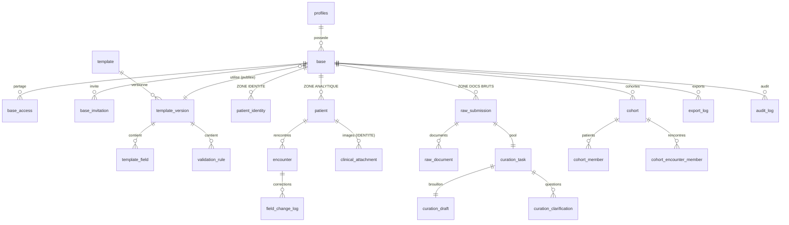

# Architecture — Registre clinique (v3.0)

> Vue d'ensemble pour un nouveau développeur. Décrit le **modèle de données**, les
> **rôles**, le **cloisonnement de sécurité (RLS)** et le **cycle de curation** tels
> qu'ils sont réellement implémentés aujourd'hui. Pour la mise en route locale, voir
> [tester-en-local.md](tester-en-local.md) et [configurer-supabase.md](configurer-supabase.md).

Spécifications de référence (reconstituées à partir du code réel, versionnées) :
**[cahier-des-charges-metier.md](cahier-des-charges-metier.md)** (fonctionnel : EF / RG) et
**[cahier-des-charges-technique.md](cahier-des-charges-technique.md)** (technique : ET). Les
références `§X.Y` dans les commentaires du code renvoient au cahier d'origine ; ce fichier-ci
en reste la **vue d'ensemble développeur**.

---

## 1. Principe central : un registre, trois zones

Le produit est **registre-centré** : l'objet central est le **patient**, pas l'étude.
Toute la sécurité repose sur le **cloisonnement de trois zones**, appliqué **côté base de
données** par Row-Level Security (RLS) — pas seulement dans l'interface.

| Zone | Tables | Contenu | Qui y accède | Exportable ? |
|---|---|---|---|---|
| **Identité** (restreinte) | `patient_identity`, `clinical_attachment` | Nom, date de naissance exacte, images cliniques | `can_view_identity` uniquement | **Jamais** |
| **Analytique** | `patient`, `encounter`, `field_change_log` | Données structurées, **âge calculé** (pas la DOB) | Selon permissions de base | Oui (sans identité) |
| **Documents bruts** (restreinte) | `raw_submission`, `raw_document` + sous-système curation | Documents source dé-identifiés à structurer | `can_view_raw_documents` / curateur affecté | **Jamais** |

**Règles non négociables :**
- Aucune donnée identifiante ni image n'apparaît dans un export.
- `patient_identity` et `patient` sont **deux tables sans clé étrangère** entre elles ;
  le seul lien est la paire `(base_id, patient_code)`.
- La **date de naissance exacte ne quitte jamais** la zone identité : l'âge est calculé
  côté serveur (`compute_age`, SECURITY DEFINER) et seul l'âge entre en zone analytique.
- La clé `service_role` de Supabase n'apparaît **jamais** dans le frontend (seules les
  variables `VITE_*` sont injectées dans le bundle).
- Données **entièrement fictives** uniquement.

---

## 2. Rôles & permissions

### 2.1 Rôle global (`profiles.global_role`) — 3 valeurs

| Rôle | Description | Accès aux données patient |
|---|---|---|
| `system_admin` | Gère les gabarits globaux et les comptes | **Aucun** |
| `medecin` | Crée et possède des bases, saisit, exporte | Ses bases + bases partagées |
| `curateur` | Structure et **finalise** les cas du pool de curation | Documents bruts des cas réservés ; **jamais l'identité** |

> Les anciens rôles `analyste` et `validateur` ont été supprimés. Le **curateur**
> structure ET finalise seul (il n'y a plus d'étape de validation séparée).

### 2.2 Rôle d'accès par base (`base_access.access_role`) — 2 valeurs

Le partage de base se fait entre médecins :

| Rôle d'accès | Permissions par défaut proposées |
|---|---|
| `viewer` | Lecture seule (aucune permission cochée par défaut) |
| `editor` | `can_view_identity` + `can_view_raw_documents` + `can_edit_structured_data` |

### 2.3 Les 5 permissions granulaires (`base_access` / `base_invitation`)

`can_view_identity`, `can_view_raw_documents`, `can_edit_structured_data`,
`can_export_data`, `can_manage_access`.

Le **propriétaire** d'une base les possède toutes. Pour un collaborateur, chaque
permission est un booléen indépendant, vérifié côté base par une fonction d'aide
(`can_view_identity(base)`, `can_export_data(base)`, …). Une invitation ne stocke que le
**hash** du jeton (`token_hash`) ; le jeton en clair n'est montré qu'une fois.

---

## 3. Modèle de données (25 tables)



### Inventaire par domaine

**Gabarits** (`template`, `template_version`, `template_field`, `validation_rule`)
Un gabarit est versionné ; une version **publiée** devient immuable. Les champs portent
type, bornes, valeurs autorisées, `required`, `scope` (permanent / rencontre) et
`allow_missing_codes`. Les règles de cohérence sont du JSON contrôlé (opérateurs en
liste blanche). Un gabarit est **global** (admin) ou **personnel** (médecin propriétaire).

**Comptes & bases** (`profiles`, `base`, `base_access`, `base_invitation`)
`profiles` est lié à `auth.users` (on ne recrée pas de table utilisateur). Une `base`
référence une version publiée de gabarit (`current_template_version_id`).

**Zone identité** (`patient_identity`, `clinical_attachment`) — restreinte, jamais exportée.

**Zone analytique** (`patient`, `encounter`, `field_change_log`)
`patient` = données permanentes ; `encounter` = rencontres avec `age_value`/`age_unit`
en colonnes (jamais la DOB). `validation_status` ∈ `draft | complete | curated`. Toute
correction est journalisée (ancienne/nouvelle valeur, auteur, motif) dans
`field_change_log`.

**Zone documents bruts & curation** (`raw_submission`, `raw_document`, `curation_task`,
`curation_draft`, `curation_clarification`) — voir §4.

**Cohortes & export** (`cohort`, `cohort_member`, `cohort_encounter_member`, `export_log`)
Une cohorte est **dynamique** ou **figée** ; seule une cohorte figée s'exporte. Le fichier
d'export est conservé immuable (`file_hash`) et tracé. `assert_export_columns_safe()`
**refuse tout champ identifiant** (liste blanche analytique).

**Audit** (`audit_log`) — trace des actions sensibles (§14) : consultation d'identité,
vue/téléchargement d'image, changement d'accès, invitation, figement de cohorte, export,
suppression, publication de gabarit.

---

## 4. Cycle de curation

Le curateur ne voit **jamais** l'identité du patient. Il structure des documents bruts
dé-identifiés, puis **finalise seul** (plus de validateur).

```
 preparing ──submit(≥1 doc)──► open ──réservation──► in_progress
                                                        │   ▲
                              clarification_requested ◄──┘   │ answer
                                          └───────────────────┘
                                                        │ finalize_curation_task()
                                                        ▼
                                  ┌────────────────────────────────────┐
                                  │ patient / encounter en `curated`    │
                                  │ âge calculé (DOB jamais exposée)     │
                                  │ field_change_log + audit_log         │
                                  └────────────────────────────────────┘
```

- **`preparing`** : le médecin prépare la demande ; le cas **n'entre pas** dans le pool
  tant qu'il n'est pas soumis avec **au moins un document**.
- **`open`** : visible dans le pool, réservable par un curateur.
- **`in_progress`** : réservé. Le curateur a accès aux documents (`is_assigned_to_submission`,
  uniquement tant que la tâche est `in_progress`/`clarification_requested`) et remplit le
  `curation_draft`.
- **`clarification_requested`** : aller-retour question/réponse via
  `request_clarification` / `answer_clarification`.
- **`completed`** : `finalize_curation_task(p_task_id)` (le curateur affecté ou le
  propriétaire) — vérifie la validité (`assert_data_valid`) **et la complétude des champs
  requis** (`assert_required_complete`), écrit les données en `curated`, ferme la tâche,
  le brouillon (`finalized`) et la soumission (`completed`). L'accès aux documents se
  referme alors.

Le médecin peut **supprimer** une demande (confirmation requise), au choix : la demande
seule, ou le patient **et** la demande.

---

## 5. Sécurité — comment c'est appliqué

- **RLS sur toutes les tables.** Une table sans politique = tout est refusé. Sur un
  `SELECT`, la RLS **masque les lignes** (0 ligne) au lieu de lever une erreur.
- **Fonctions d'aide `SECURITY DEFINER`** (`20260616090300_functions.sql`) : `is_system_admin`,
  `is_medecin`, `is_curateur`, `is_base_owner`, `has_base_access`, `can_view_identity`,
  `can_export_data`, etc. Elles lisent `base`/`base_access` sans déclencher leur propre RLS
  (pas de récursion) et ne renvoient qu'un booléen sur `auth.uid()`.
- **Âge calculé côté serveur.** Un `editor` sans accès identité peut saisir des rencontres
  avec âge **sans jamais voir la date de naissance** (§4.1).
- **Anti-fuite à l'export.** Liste blanche analytique ; tout champ identifiant est rejeté.
- **`service_role` jamais dans le frontend** : le client navigateur n'utilise que la clé
  ANON.
- **Limite honnête** : la RLS empêche l'accès *applicatif* aux identités ; l'administrateur
  du serveur peut techniquement lire la base. Une garantie forte supposerait un chiffrement
  côté client (hors périmètre MVP). **Aucune donnée réelle** tant que le cadre juridique
  n'est pas établi.

---

## 6. Carte du code

| Couche | Emplacement | Rôle |
|---|---|---|
| **Migrations SQL** | `supabase/migrations/` | Schéma, RLS, fonctions, RPC — source de vérité |
| Données de démo | `supabase/seed.sql` | Comptes + 10 patients **fictifs** |
| Storage | `supabase/storage.sql` | Buckets privés + RLS |
| **Repositories** | `src/data/` | Accès aux données, injectables (`RepositoryProvider`) |
| **Domaine pur** | `src/domain/` | Validation de saisie, règles JSON, inspection de fichier |
| **Écrans** | `src/screens/member`, `src/screens/staff` | UI React |
| Auth & rôles | `src/auth/` | `AuthProvider`, gating par rôle (logique pure testée) |
| i18n | `src/i18n/` | Messages fr/en |
| **Tests** | `test/` (db) + `src/**/*.test.tsx` (web) | RLS + domaine + rendu |

### Liste des migrations (ordre d'application, 36 au total)

```
# Socle (schéma, RLS, RPC, intégrité)
090100_extensions   090200_tables     090300_functions   090400_rls
090500_integrity    090600_rpc        090700_template_admin
090800_patients     090900_encounters 091000_corrections 091100_cohorts
091200_access       091300_soft_delete 091400_curation   091500_audit

# Durcissement (édition de champs, import, validation, audits successifs)
091600_template_field_edit   091700_reorder_template_fields
091800_import                091900_validation_rules        092000_import_hardening
092100_cohort_eligibility    092200_encounter_optimistic_lock
092300_guard_curated_downgrade  092400_logs_infalsifiable   092500_curation_rpc_only
092600_curation_draft_scope  092700_import_batch_hardening  092800_cross_base_integrity
092900_rpc_only_clinical_writes  093000_pool_minimal_metadata
093100_template_rule_versioning  093200_field_attrs_and_patient_edit
093300_rpc_only_writes_complete  093400_import_p1_hardening
093500_offline_snapshot_rpc      093600_import_duplicate_warnings
```

---

## 7. Tests

Pas de Docker sur le poste de développement : les tests démarrent un **vrai PostgreSQL 18
embarqué** (`embedded-postgres`) et appliquent **exactement les mêmes migrations** que
celles destinées à Supabase. Un mince *shim* ([test/harness/000_supabase_shim.sql](../test/harness/000_supabase_shim.sql))
recrée ce que Supabase fournit déjà (`auth.uid()`, rôles) ; il n'est jamais appliqué en réel.

```bash
npm test            # tout : RLS (projet db) + frontend (projet web)
npm run test:rls    # uniquement la sécurité RLS
npm run test:web    # uniquement le rendu UI
```

État actuel : **40 fichiers / 292 tests verts** (36 migrations). Chaque refus RLS est doublé d'un
**contrôle positif** prouvant qu'un utilisateur légitime voit bien la donnée (pas de faux
positif par table vide).

---

## 8. Comptes de démonstration (`seed.sql`, mot de passe `Password123!`)

| Email | Rôle global | Accès |
|---|---|---|
| `admin@demo.test` | `system_admin` | Administration ; **aucune** donnée patient |
| `templates@demo.test` | `system_admin` | Gestion des gabarits globaux |
| `alice@demo.test` | `medecin` (propriétaire) | Accès complet à sa base (identité incluse) |
| `bob@demo.test` | `medecin` | 2ᵉ médecin, sans accès à la base d'Alice |
| `editor@demo.test` | `medecin` | Collaborateur `editor` (identité + documents) |
| `curator1@demo.test` | `curateur` | Pool de curation (structure/finalise, **sans** identité) |
| `curator2@demo.test` | `curateur` | Pool de curation |
| `validator@demo.test` | `curateur` | Compte hérité (le rôle `validateur` est supprimé) |
| `anna.analyst@demo.test` | `medecin` | `viewer` + `can_export_data` sur la base d'Alice (export **sans** identité) |
