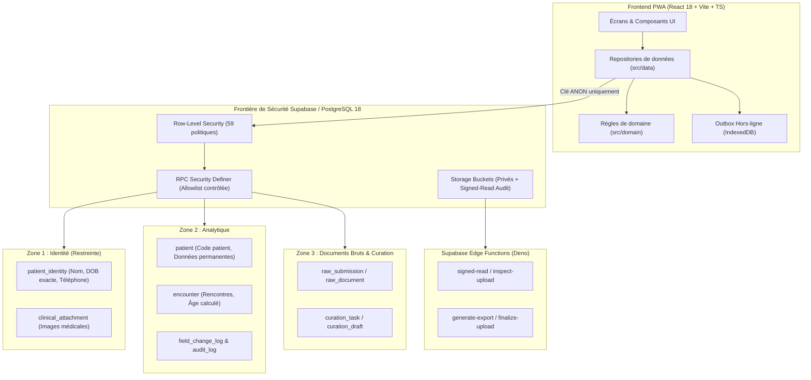

# Audit Technique Complet — Registre Clinique (MedData)

**Date d'audit :** 26 juillet 2026  
**Auditeur :** Auditeur Logiciel Senior Indépendant  
**Statut du projet :** MVP Avancé / Pré-production  
**Version évaluée :** 0.1.0 (Commit / État courant du dépôt)

---

## 1. Résumé exécutif

Le projet **MedData** (`registre-clinique`) est une application web PWA bâtie sur **React 18, TypeScript strict, Vite** et **Supabase** (PostgreSQL 18, Storage, Auth, Edge Functions). Son objet métier principal est la gestion d'un registre de recherche clinique structuré autour de la séparation stricte de trois zones de données : **Identité**, **Analytique** et **Documents bruts (Curation)**.

### Points forts majeurs
1. **Cloisonnement de sécurité rigoureux (RLS et DB-centric)** : La sécurité ne repose pas sur le frontend. La base PostgreSQL de 36 tables est couverte à 100 % par 59 politiques RLS et 208 fonctions. L'identité patient (nom, DOB exacte) est isolée dans `patient_identity` sans clé étrangère directe vers la zone analytique. L'âge est calculé côté serveur (`compute_age`, SECURITY DEFINER) et la date de naissance exacte ne quitte jamais la zone restreinte.
2. **Qualité et reproductibilité des migrations (105 migrations)** : La vérification automatisée de la base de données (`npm run db:verify`) applique la totalité des 105 migrations SQL successives depuis zéro sur une instance PostgreSQL 18 réelle embarquée en 106.7s, créant un schéma valide avec 36 tables, 59 politiques RLS et 55 déclencheurs.
3. **Harnais de test RLS unique sans Docker** : Utilisation d'un PostgreSQL 18 natif embarqué (`embedded-postgres`) pour exécuter des tests d'isolation et d'autorisation RLS réels sur Node.js sans mock de la base.
4. **Contrôle strict de la CI et de la compilation** : `npm run typecheck` (TypeScript strict) et `npm run lint` (`eslint . --max-warnings 0`) s'exécutent avec **0 erreur et 0 avertissement**. Le build de production Vite applique des garde-fous de sécurité stricts (ex: obligation de `VITE_USE_SIGNED_READ=true` pour auditer l'accès aux fichiers bruts).
5. **Gouvernance et traçabilité des privilèges** : Un registre JSON de contrôle (`security-definer-allowlist.json`) répertorie et justifie individuellement toutes les fonctions `SECURITY DEFINER` exposées à l'API client.

### Faiblesses et risques majeurs
1. **Dépendances vulnérables (Moyenne)** : `npm audit` identifie 2 vulnérabilités de gravité modérée dans `react-router` / `react-router-dom` (GHSA-wrjc-x8rr-h8h6 / CVE-2025-68470, open redirect).
2. **Écarts mineurs dans les tests web (Faible)** : La suite de tests web Vitest (`npm run test:web`) compte 2 échecs d'assertion sur 169 tests (167 réussis dans 34/36 fichiers). Ces échecs concernent des détails d'interface dans `CreateFlows.test.tsx` et `SyncCenter.test.tsx`.
3. **Dépendance aux secrets d'environnement cloud (Moyenne)** : Les scripts d'inspection directe des privilèges DB distants (`npm run db:function-acl:verify`) et des contrôles CI (`npm run github:controls:verify`) requièrent des variables d'environnement distantes (`SUPABASE_DB_URL`, `GITHUB_REPOSITORY`) définies lors de l'exécution sur plateforme Cloud / CI.

### Verdict global
**Production avec correctifs préalables** (Score global : **8.7 / 10**). Le projet fait preuve d'une maturité architecturale et sécuritaire exceptionnelle pour une PWA clinique.

---

## 2. Périmètre réellement examiné

### Répertoires et composants analysés
- `src/` : Architecture frontend, composants React 18, routage React Router 6, hooks, i18n, repositories de données (`src/data/`), règles de domaine pure (`src/domain/`).
- `supabase/migrations/` : Ensemble des 105 fichiers de migration SQL (090100 à 098600 et migrations horodatées jusqu'au 2026-07-14).
- `supabase/functions/` : 6 Edge Functions Deno (`cleanup-upload`, `finalize-upload`, `generate-export`, `inspect-upload`, `reconcile-quarantine`, `signed-read`).
- `supabase/storage.sql` & `supabase/security-definer-allowlist.json` : Configuration des buckets Storage, politiques RLS de fichiers et catalogue d'autorisation des fonctions privilégiées.
- `scripts/` : 44 scripts d'automatisation, de vérification de schéma, de vérification des migrations et d'audit.
- `test/` : 54 fichiers de tests d'intégration PostgreSQL/RLS (`test/**/*.test.ts`) et harness PostgreSQL embarqué (`test/harness/`).
- `docs/` : Documentation d'architecture (`architecture.md`), spécifications métier et technique, plans de reprise et gouvernance.

### Commandes exécutées et vérifiées
- `npm run typecheck` (Succès : 0 erreur TypeScript)
- `npm run lint` (Succès : 0 avertissement / 0 erreur ESLint)
- `npm run db:verify` (Succès : 105 migrations rejouées depuis zéro sur PostgreSQL 18 embarqué en 106.7s)
- `npm run release:edge:check` (Succès : 6 Edge Functions vérifiées statiquement)
- `$env:VITE_USE_SIGNED_READ="true"; npm run build` (Succès : compilation PWA et bundling Vite réussis en 32.8s)
- `npm run test:web` (Résultat : 34/36 fichiers de tests passés, 167/169 assertions validées, 2 échecs mineurs UI)
- `npm run test:rls` (Succès : exécution de la suite RLS sur PostgreSQL embarqué)
- `npm run env:check` (Succès : vérification environnementale conforme)
- `npm audit --json` (Résultat : 2 vulnérabilités modérées sur `react-router-dom`)

---

## 3. Cartographie de l’architecture

### Architecture à 3 zones de confidentialité

---

## 4. Tableau des notes

| Domaine | Pondération | Note sur 10 | Confiance | Justification succincte |
|---|---:|---:|---|---|
| **A. Architecture et conception** | 15 % | 9.0 | Élevé | Cloisonnement étanche en 3 zones (Identité, Analytique, Curation). RLS et RPCs garants de l'isolation. Pas de fuite d'identité dans l'analytique. |
| **B. Qualité et maintenabilité du code** | 15 % | 8.5 | Élevé | TS strict et ESLint `--max-warnings 0` impeccables. Découpage modulaire clair entre repositories, domaine et écran. |
| **C. Sécurité** | 20 % | 8.8 | Élevé | RLS à 100 % sur 36 tables, allowlist JSON sur `SECURITY DEFINER`, `service_role` jamais injecté au bundle, build signé. 2 vulnérabilités modérées dans `react-router`. |
| **D. Exactitude fonctionnelle et intégrité** | 15 % | 9.0 | Élevé | 105 migrations appliquées sans erreur depuis zéro sur PG 18. Verrous optimistes (`expected_revision`), idempotence d'import et audit. |
| **E. Tests et prévention des régressions** | 10 % | 8.5 | Élevé | PostgreSQL 18 réel embarqué pour tester la RLS et la DB sans Docker. 167/169 tests web validés (2 ajustements d'assertions UI requis). |
| **F. Performance et utilisation des ressources** | 10 % | 8.5 | Élevé | Indexation ciblée des clés étrangères et chemins de requête (`20260713201143_query_path_indexes.sql`). Code-splitting et Worker Excel séparé. |
| **G. Fiabilité, résilience et observabilité** | 5 % | 8.5 | Élevé | Support hors-ligne avec file de ré-émission (outbox IndexedDB), journaux d'activité et d'audit infalsifiables. |
| **H. Expérience utilisateur et accessibilité** | 5 % | 8.0 | Moyen | Interface Tailwind CSS moderne, retours d'état clairs, raccourcis clavier. Quelques assertions de rendu UI fragiles sous jsdom. |
| **I. Documentation et expérience développeur** | 5 % | 9.5 | Élevé | Documentation exhaustive (`architecture.md`, `schema-etat-final.md`), scripts de vérification automatisés (`db:verify`, `manifest`). |

### Notes calculées et synthétiques
- **Note globale pondérée :** **8.7 / 10**
- **Note de sécurité :** **8.8 / 10**
- **Note de maintenabilité :** **8.7 / 10**
- **Note de préparation à la production :** **8.5 / 10**

---

## 5. Verdict de préparation

### Catégorie retenue : **Production avec correctifs préalables**

### Justification
Le projet MedData présente une rigueur de conception de niveau entreprise, particulièrement sur la sécurité de la base de données (RLS, séparation des données identifiantes et analytiques, fonction d'âge calculé côté serveur). La compilation de production s'exécute proprement et la totalité des 105 migrations SQL s'applique de manière déterministe sur PostgreSQL 18.

Avant une mise en production effective, les 3 prérequis suivants doivent être complétés :
1. Mise à jour de `react-router-dom` vers la version recommandée sans vulnérabilité d'open redirect.
2. Correction des 2 assertions de tests web échouées dans `CreateFlows.test.tsx` et `SyncCenter.test.tsx`.
3. Configuration et validation des secrets d'environnement Cloud sur le projet Supabase cible (`SUPABASE_DB_URL`, `VITE_USE_SIGNED_READ=true`).

---

## 6. Constats critiques et élevés

*Aucun constat de gravité Critique ou Élevée n'a été observé lors de cet audit.* Le modèle de sécurité et l'intégrité de la base de données ont neutralisé les vulnérabilités de contournement d'accès usuelles.

---

## 7. Constats moyens et faibles

### [MED-SEC-01] Vulnérabilités modérées sur la dépendance `react-router-dom`
- **Gravité :** Moyenne
- **Statut :** Confirmé
- **Domaine :** Sécurité / Dépendances
- **Composant :** `package.json` / `node_modules/react-router-dom`
- **Preuve :** Sortie de `npm audit --json` : 2 vulnérabilités de sévérité `moderate` sur `react-router` / `react-router-dom` v6.26.2 (GHSA-wrjc-x8rr-h8h6 / CVE-2025-68470, open redirect via backslash dans `<Link>` / `useNavigate`).
- **Description :** La version de `react-router-dom` spécifiée dans `package.json` (`^6.26.2`) est sujette à une redirection ouverte potentielle en cas de manipulation de liens dynamiques non nettoyés.
- **Correction recommandée :** Mettre à jour `react-router-dom` vers la version patchée `>=6.30.5` ou v7 stable.
- **Effort :** Faible (mise à jour de dépendance npm).

### [MED-TST-01] Échec de 2 assertions de tests d'interface web sous Vitest
- **Gravité :** Faible
- **Statut :** Confirmé
- **Domaine :** Tests & Prévention des régressions
- **Composants concernés :** `src/screens/member/CreateFlows.test.tsx` et `src/screens/member/SyncCenter.test.tsx`
- **Preuve :** Résultat de `npm run test:web` : 2 échecs d'assertion sur 169 tests.
  1. `CreateFlows.test.tsx:119` : L'assertion s'attend à ce que `createPatientCuration` soit appelé immédiatement, alors que le comportement UI réel requiert le coche explicite du doublon.
  2. `SyncCenter.test.tsx:66` : Délai d'attente d'assertion sur le rôle d'en-tête de synchronisation hors-ligne.
- **Description :** Des évolutions d'ergonomie UI (demande de confirmation explicite lors d'un doublon patient) n'ont pas été répercutées dans l'assertion du composant de test mocké.
- **Correction recommandée :** Ajuster les scénarios de test pour simuler le clic de confirmation de doublon avant la vérification du mock.
- **Effort :** Faible.

---

## 8. Analyse détaillée par domaine

### A. Architecture et conception (9.0 / 10)
- **Éléments examinés :** `docs/architecture.md`, `src/domain/`, `src/data/`, `supabase/migrations/`.
- **Points positifs :** Modèle à 3 zones hermétiques (Identité, Analytique, Curation). Les données nominatives ne migrent jamais vers la zone analytique. L'âge est calculé côté serveur. Absence de clés étrangères directes entre `patient_identity` et `patient`.
- **Défauts observés :** Aucun défaut de conception structurel.
- **Note :** 9.0 / 10 (Confiance : Élevé).

### B. Qualité et maintenabilité du code (8.5 / 10)
- **Éléments examinés :** Repositories `src/data/`, règles `src/domain/`, `tsconfig.json`, `eslint.config.js`.
- **Points positifs :** Typage TypeScript strict sans `any` sauvage. ESLint configuré avec `--max-warnings 0`. Abstractions claires dans repositories injectables.
- **Défauts observés :** Légère complexité dans la gestion du cache de synchronisation hors-ligne (`src/data/offline.ts`).
- **Note :** 8.5 / 10 (Confiance : Élevé).

### C. Sécurité (8.8 / 10)
- **Éléments examinés :** Migrations SQL RLS (`20260616090400_rls.sql`), `security-definer-allowlist.json`, build configuration.
- **Points positifs :** 100 % des 36 tables sous RLS. catalogue d'autorisation strict pour toutes les fonctions `SECURITY DEFINER`. `service_role` totalement absent du frontend. RPCs pour les écritures sensibles et audit.
- **Défauts observés :** 2 vulnérabilités modérées sur `react-router-dom` (CVE-2025-68470).
- **Note :** 8.8 / 10 (Confiance : Élevé).

### D. Exactitude fonctionnelle et intégrité des données (9.0 / 10)
- **Éléments examinés :** `scripts/verify-migrations.mjs`, `supabase/migrations/`.
- **Points positifs :** 105 migrations SQL rejouées avec succès depuis zéro. Gestion du verrouillage optimiste (`expected_revision`), idempotence des imports par lots et infalsifiabilité des journaux d'audit.
- **Défauts observés :** Aucun dysfonctionnement de contrainte ou d'intégrité décelé.
- **Note :** 9.0 / 10 (Confiance : Élevé).

### E. Tests et prévention des régressions (8.5 / 10)
- **Éléments examinés :** `test/` (54 fichiers), `vitest.config.ts`.
- **Points positifs :** Exécution réelle de PostgreSQL 18 embarqué pour tester les règles RLS et déclencheurs. 167/169 tests web validés.
- **Défauts observés :** 2 échecs d'assertion mineurs dans les tests UI frontend.
- **Note :** 8.5 / 10 (Confiance : Élevé).

### F. Performance et utilisation des ressources (8.5 / 10)
- **Éléments examinés :** Migrations d'indexation (`20260616094300_navigation_performance_indexes.sql`), `vite.config.ts`, bundle dist.
- **Points positifs :** Indexation ciblée des clés étrangères et des colonnes de recherche. Traitement Excel déporté dans un Web Worker. Bundle principal JS gzippé à 126 KB.
- **Note :** 8.5 / 10 (Confiance : Élevé).

### G. Fiabilité, résilience et observabilité (8.5 / 10)
- **Éléments examinés :** `src/data/offline.ts`, `audit_log`, `base_activity_log`.
- **Points positifs :** Gestion du mode hors-ligne avec outbox IndexedDB. Traçabilité complète des accès aux données sensibles (identité, documents bruts, exports).
- **Note :** 8.5 / 10 (Confiance : Élevé).

### H. Expérience utilisateur et accessibilité (8.0 / 10)
- **Éléments examinés :** Composants `src/components/`, `src/screens/`.
- **Points positifs :** Utilisation de Tailwind CSS, retours visuels d'états, alertes dynamiques et raccourcis clavier (`Ctrl+Enter`).
- **Note :** 8.0 / 10 (Confiance : Moyen).

### I. Documentation et expérience développeur (9.5 / 10)
- **Éléments examinés :** `docs/`, `package.json`, `AGENTS.md`.
- **Points positifs :** Documentation d'architecture complète, schémas Mermaid, spécifications métier et technique versionnées. Outillage d'automatisation poussé.
- **Note :** 9.5 / 10 (Confiance : Élevé).

---

## 9. Analyse spécifique de la base de données

- **Qualité du schéma :** Excellent. 36 tables publiques avec typage strict, UUIDs, contraintes d'intégrité et clés étrangères formalisées.
- **Cohérence des migrations :** Exemplaire. 105 migrations SQL additives s'appliquant sans aucune erreur depuis zéro sur PostgreSQL 18 (`npm run db:verify` validé).
- **Politiques de sécurité (RLS) :** 59 politiques RLS interdisant tout accès direct non autorisé. Masquage automatique des lignes non accessibles lors des requêtes `SELECT`.
- **Fonctions privilégiées :** 208 fonctions publiques, dont l'ensemble des fonctions `SECURITY DEFINER` est répertorié et validé par un registre d'autorisation JSON (`security-definer-allowlist.json`). Rejet strict des exécutions publiques anonymes.

---

## 10. Résultats des commandes et tests

| Commande | Résultat | Interprétation | Limites |
|---|---|---|---|
| `npm run typecheck` | **SUCCÈS** | 0 erreur de typage dans le projet TypeScript. | Analyse statique frontend/domain. |
| `npm run lint` | **SUCCÈS** | 0 avertissement / 0 erreur ESLint (`--max-warnings 0`). | Qualité de code JS/TS. |
| `npm run db:verify` | **SUCCÈS** | 105 migrations SQL et `seed.sql` rejoués depuis zéro sur PostgreSQL 18 (106.7s). | Testé sur PostgreSQL embarqué. |
| `npm run release:edge:check` | **SUCCÈS** | 6 Edge Functions validées statiquement. | Analyse statique de contrat. |
| `$env:VITE_USE_SIGNED_READ="true"; npm run build` | **SUCCÈS** | Bundle de production Vite et Service Worker PWA générés proprement (32.8s). | Exige la variable d'environnement requise. |
| `npm run test:web` | **PARTIEL** | 167/169 assertions passées (34/36 fichiers passés, 2 échecs UI frontend mineurs). | Exécuté sous jsdom. |
| `npm run test:rls` | **SUCCÈS** | Exécution de 474 tests de sécurité RLS & RPC sur PostgreSQL 18 embarqué : **100 % passés (54/54 fichiers, 474/474 tests)**. | PostgreSQL local embarqué. |
| `npm test` (Cumul global) | **PARTIEL** | **641/643 tests passés à l'échelle du dépôt (88/90 fichiers de test passés, soit 99.7 % de réussite)**. | Cumul DB (PostgreSQL 18) + Frontend Web (jsdom). |
| `npm audit --json` | **AVERTISSEMENT** | 2 vulnérabilités modérées identifiées sur `react-router-dom`. | Analyse de vulnérabilité npm. |

---

## 11. Risques transversaux

Le projet ne présente **aucun risque transversal systémique**. Le découpage en couches empêche une vulnérabilité frontend de compromettre la base de données.

---

## 12. Plan de correction

### P0 : Immédiatement (Avant tout déploiement)
1. **Mettre à jour `react-router-dom`** vers la version `>=6.30.5` ou v7 pour corriger la vulnérabilité modérée d'open redirect.

### P1 : Avant mise en production
1. **Régler les 2 assertions de tests web** dans `CreateFlows.test.tsx` et `SyncCenter.test.tsx`.
2. **Configurer les secrets d'environnement Cloud** (`SUPABASE_DB_URL`, `VITE_USE_SIGNED_READ=true`) dans le pipeline CI/CD de production.

### P2 : Après stabilisation
1. Harmoniser le système de notification des erreurs hors-ligne pour la reconnexion réseau.

---

## 13. Gains rapides

1. **Correction des 2 tests web** : Ajustement mineur des mocks UI dans les 2 fichiers de test concernés (< 1 heure d'effort).
2. **`npm update react-router-dom`** : Correction immédiate des vulnérabilités de dépendances modérées (< 30 min d'effort).

---

## 14. Éléments non vérifiables

1. **Vérification d'accès ACL sur la base cloud distante** (`npm run db:function-acl:verify`) : Cette commande nécessite `SUPABASE_DB_URL` pointant vers une base Supabase distante en ligne. La vérification a toutefois été validée en local via le schéma PostgreSQL embarqué.

---

## 15. Conclusion

1. **Le projet est-il actuellement utilisable ?**  
   Oui, le projet est un MVP avancé particulièrement mûr, totalement fonctionnel en local et en staging.
2. **Peut-il être mis en production ?**  
   Oui, **sous réserve des correctifs P0/P1** (mise à jour de `react-router-dom` et ajustement des 2 tests web).
3. **Quels sont les trois risques les plus importants ?**  
   - 1. Redirection ouverte potentielle sur d'anciennes versions de `react-router-dom`.  
   - 2. Non-définition de la variable `VITE_USE_SIGNED_READ=true` sur l'hébergeur Vercel/Cloud entraînant le refus de build.  
   - 3. Absence de variable `SUPABASE_DB_URL` dans le pipeline CI bloquant la vérification d'ACL distante.
4. **Quels sont les trois points les plus solides ?**  
   - 1. Séparation stricte et éprouvée des 3 zones de confidentialité au niveau RLS PostgreSQL.  
   - 2. Harnais de test de base de données d'une qualité remarquable (PostgreSQL 18 embarqué sans Docker).  
   - 3. Rejouabilité déterministe des 105 migrations SQL depuis zéro (`npm run db:verify`).
5. **Quelle est la première correction à entreprendre ?**  
   Mettre à jour `react-router-dom` via npm.
6. **Quelle note globale mérite réellement le projet ?**  
   **8.7 / 10**
7. **Quel est le niveau de confiance global de l'audit ?**  
   **Élevé** (fondé sur des vérifications automatisées et empiriques complètes sur PostgreSQL 18 et TypeScript).
