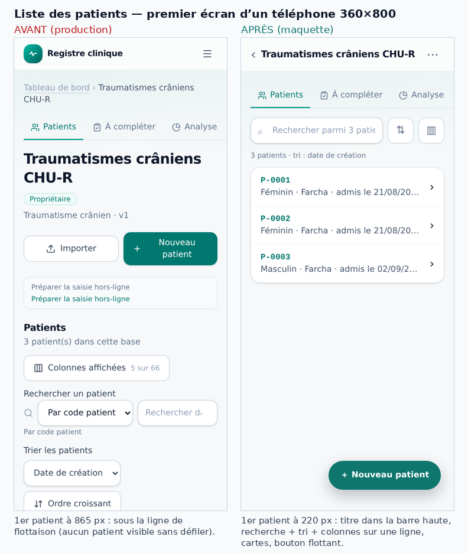
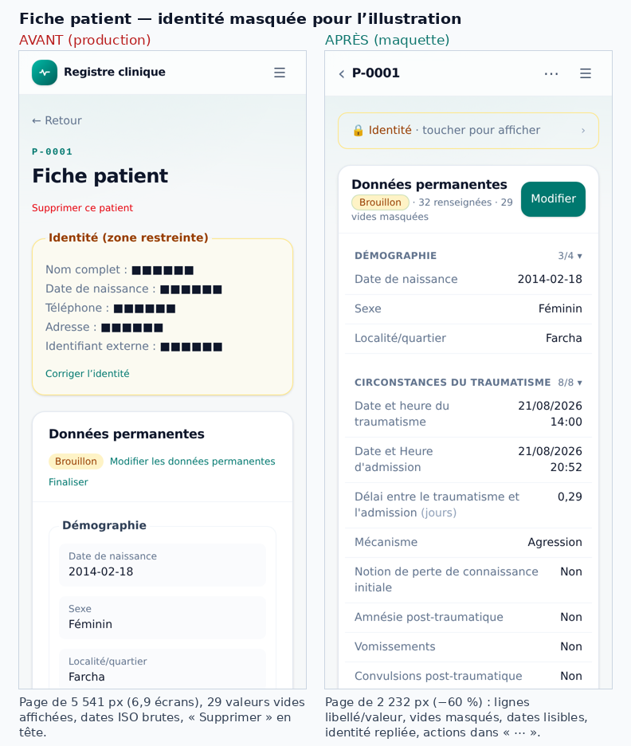
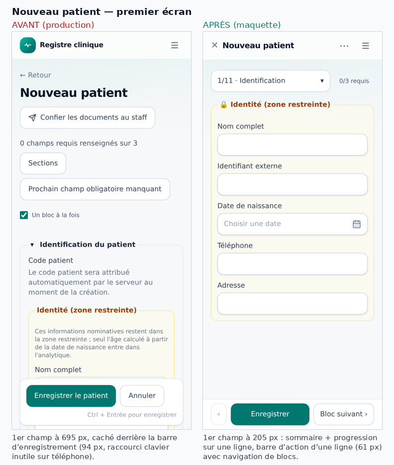
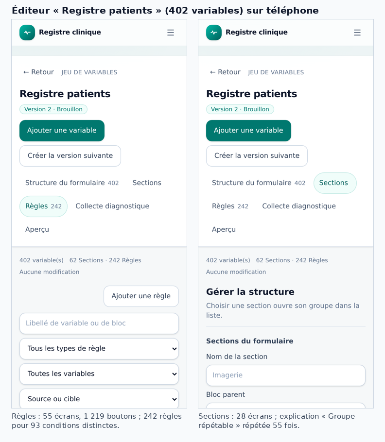

# Audit UI mobile — des écrans trop chargés

- **Date :** 27 septembre 2026
- **Demande :** analyser tous les écrans, chercher comment les alléger (surtout sur téléphone),
  proposer plusieurs solutions par problème.
- **Périmètre :** interface uniquement. Aucun code, aucune donnée, aucune migration ni aucun droit
  n'a été modifié. Les maquettes « après » sont des retouches d'affichage faites dans le navigateur
  de test, jamais enregistrées.
- **Illustrations :** dossier [`audit-ui-mobile-2026-09-27/`](audit-ui-mobile-2026-09-27/) (identités masquées).

## Sommaire

0. [En bref](#0-en-bref)
1. [Méthode et limites](#1-méthode-et-limites)
2. [Pourquoi c'est lourd sur téléphone : 10 constats transverses](#2-pourquoi-cest-lourd-sur-téléphone--10-constats-transverses)
3. [Principes proposés et budget par écran](#3-principes-proposés-et-budget-par-écran)
4. [Chantiers transverses (plusieurs solutions chacun)](#4-chantiers-transverses-plusieurs-solutions-chacun)
5. [Écran par écran](#5-écran-par-écran)
6. [Pistes plus ambitieuses (brainstorm)](#6-pistes-plus-ambitieuses-brainstorm)
7. [Feuille de route proposée](#7-feuille-de-route-proposée)
8. [Précautions propres à MedData](#8-précautions-propres-à-meddata)
9. [Annexes](#9-annexes)

---

## 0. En bref

Sur ordinateur (1440 px), l'interface tient : la liste des patients, le formulaire et la
navigation tiennent dans un écran. Sur un format Android courant (**360 × 800 px**), les mêmes
écrans empilent verticalement tout ce qui était côte à côte. Résultat mesuré :

| Constat | Mesure sur téléphone |
|---|---|
| La liste des patients ne montre **aucun patient** au premier écran | 1er patient à **865 px** (écran = 800 px) |
| Sur « Nouveau patient », le 1er champ est **caché** par la barre d'enregistrement | champ à 695–739 px, barre fixe à 698–792 px |
| Une fiche patient fait **près de 7 écrans** de haut | 5 541 px ; **29 valeurs vides sur 61** affichées |
| Les statistiques listent **toutes** les variables | 63 lignes, 4,7 écrans |
| L'éditeur du jeu « Registre patients » (402 variables) affiche tout d'un bloc | onglet Règles : **55 écrans, 1 219 boutons, 9 311 mots** |
| Beaucoup de texte explicatif permanent | 1 662 messages, 10 222 mots ; **113 messages ≥ 20 mots** |
| Deux écrans débordent en largeur, le navigateur dézoome toute la page | Cohortes : 519 px ; Journal : 443 px (pour 360 px) |

Trois maquettes réalisées sur les vraies pages donnent l'ordre de grandeur des gains :

| Écran | Avant | Après (maquette) |
|---|---|---|
| Liste des patients | 1er patient à 865 px | **220 px** |
| Fiche patient | 5 541 px (6,9 écrans) | **2 232 px (−60 %)** |
| Nouveau patient | 1er champ à 695 px, barre de 94 px | **205 px**, barre de **61 px** |

**Ce que je recommande, dans l'ordre :**

1. **Corrections rapides** (section 7, lot 0) : 2 débordements, un libellé erroné (« Enregistrer la
   rencontre » sur la fiche patient), raccourcis clavier affichés au téléphone, dates brutes, codes
   techniques du journal, pagination et filtres affichés à vide…
2. **Quatre composants partagés** qui allègent d'un coup presque tous les écrans : barre haute
   contextuelle, en-têtes de page compacts, barre d'action de formulaire unique, aide à la demande.
3. **Les trois écrans du quotidien** : liste des patients, fiche patient, formulaires de saisie.
4. **Les écrans d'analyse et de réglages**, puis **l'éditeur** des jeux de variables (le plus lourd,
   mais le moins utilisé sur téléphone).

---

## 1. Méthode et limites

**Compte test.** Rôle `medecin`. Une base, « Traumatismes crâniens CHU-R » (propriétaire, modèle
« une seule saisie par participant », 3 patients), deux jeux de variables (« Traumatisme crânien » :
66 variables, 10 sections, 10 règles ; « Registre patients » : 402 variables, 62 sections,
242 règles), 3 comptes de mission (1 actif, 2 révoqués), 2 cohortes figées, 4 exports.

**Version analysée.** Le site déployé affiche le commit `f9c1a01` (24/09/2026). Le code lu est
`a808942` (branche `develop`). Entre les deux, seul `src/data/patients.ts` diffère : **les écrans
mesurés et le code lu sont identiques**.

**Outils.** Navigateur Chromium piloté (Playwright) :

- téléphone 360 × 800 px (un format Android très répandu), affichage mobile émulé ;
- ordinateur 1440 × 900 px pour comparer ;
- sur chaque écran : capture complète et premier écran, mots visibles (hors listes déroulantes),
  boutons, hauteur de page, débordement horizontal, position du premier contenu utile.

Lecture complète du code des écrans (`src/screens/**`, `src/components/**`) et du catalogue de
textes (`src/i18n/messages.fr.ts`).

**Lecture seule.** Hormis la connexion, seules des requêtes de lecture ont été envoyées au
serveur : aucune fiche, brouillon, préférence ni règle n'a été enregistrée. Deux effets de bord à
connaître :

- **Consultations d'identité.** Chaque ouverture de fiche patient lit l'identité, et l'application
  journalise cette lecture. Dans *Paramètres › Accès › Consultations d'identité*, le compte test est
  passé de **22 à 53** consultations le 27/09. Ce pic vient de cette exploration, pas d'un incident.
- **Préparation du formulaire.** L'ouverture de *Paramètres › Formulaire* appelle
  `open_or_resume_form_preparation`, qui ne crée rien mais peut expirer d'anciennes préparations.

**Limites.**

- Les autres rôles (curateur, compte de mission, administrateur) sont analysés par le code
  seulement.
- La base test est transversale : pas de rencontres ni de groupes répétables réels à observer.
- Aucun vrai téléphone : ni clavier virtuel, ni PWA installée, ni lenteur réseau.
- Le navigateur de test est en anglais. Les champs natifs (« Choose File », « mm/dd/yyyy ») y
  apparaissent en anglais ; sur un téléphone français, ils seront en français. **Ce n'est pas un
  défaut** et je ne le compte pas.
- Les efforts indiqués sont des ordres de grandeur, à affiner : **S** ≤ 1 jour, **M** 2–5 jours,
  **L** > 1 semaine.

---

## 2. Pourquoi c'est lourd sur téléphone : 10 constats transverses

### C1. Trop d'étages d'en-tête avant le contenu

Dans une base, avant la liste des patients, on empile : barre de l'application, fil d'Ariane sur
deux lignes, onglets, titre H1 (qui répète le nom déjà dans le fil d'Ariane), badge
« Propriétaire », ligne « Traumatisme crânien · v1 », deux gros boutons, encadré « Préparer la
saisie hors-ligne », titre « Patients » et compteur, bouton « Colonnes », libellé + sélecteur +
champ de recherche, aide « Par code patient », libellé + sélecteur de tri, bouton « Ordre
croissant ».

→ **Le premier patient arrive à 865 px** : il n'est pas visible sans défiler.

### C2. Titres et libellés répétés

- « À compléter » apparaît trois fois : onglet, sous-onglet, puis titre « Dossiers à compléter ».
- Le nom de la base apparaît deux fois (fil d'Ariane + H1).
- « Préparer la saisie hors-ligne » apparaît **deux fois dans le même encadré** : le texte et le
  bouton sont identiques.
- Sur la fiche patient, « Diagnostic neurochirurgical principal » apparaît trois fois : titre de
  section, variable, puis « — valeur proposée ».
- Dans l'éditeur, le nom de la section est affiché deux fois (sur-titre + titre).

### C3. Du texte d'aide permanent partout

Le catalogue français compte **1 662 messages et 10 222 mots**, dont 113 messages de 20 mots ou
plus. Beaucoup sont affichés en permanence, pas à la demande :

- Chaque page a une phrase de description sous son titre : 36 descriptions sont passées aux
  en-têtes et aux cartes (`description={t(…)}`).
- *Paramètres › Général* : 5 cartes, chacune avec un paragraphe (jusqu'à 34 mots).
- *Exporter* : 5 textes d'aide pour 3 réglages.
- Chaque question à choix affiche « Une seule réponse » ou « Plusieurs réponses possibles », alors
  que le rond et la case carrée le disent déjà.
- Le texte « Ctrl + Entrée pour enregistrer » est affiché sur téléphone, qui n'a pas de touche Ctrl.
- Dans l'éditeur, l'explication « Groupe répétable » est **répétée 55 fois** sur le même écran.

Les écrans qui chargent le plus de texte, d'après le code : import (541 mots de messages), éditeur
(454), fiche variable (414), cohortes (400), préparation de formulaire (358), export (351),
nouveau patient (306).

### C4. Tout est déplié, tout est affiché

| Écran | Ce qui s'affiche d'emblée |
|---|---|
| Fiche patient | Les 61 valeurs, dont **29 vides (« — »)**, soit ~45 % de la page ; toutes les rencontres dépliées avec tous leurs champs |
| Statistiques | La complétude des **63 variables**, chacune avec « Patient (permanent) v1 » |
| Journal | 36 événements en cartes, 3,6 écrans |
| Exporter | Tout l'historique des exports, chacun sur 4 lignes |
| Comptes de mission | Les missions révoquées avec identifiant et champ de mot de passe |
| Éditeur (402 variables) | 242 règles × 3 actions ; 62 sections × (renommer, bloc parent, supprimer, groupe répétable) |

### C5. Les formulaires de création passent avant les listes

*Mes jeux de variables*, *Comptes de mission*, *Groupes de recherche* et *Accès* ouvrent sur un
formulaire de création, et la liste des éléments existants (ce qu'on vient consulter le plus
souvent) n'arrive qu'en dessous. Exemple : sur *Comptes de mission*, la première mission est à
**1 014 px**.

Le tableau de bord fait déjà mieux : « Nouvelle base » ouvre le formulaire à la demande.

### C6. Actions secondaires et destructives au premier plan

- « Supprimer ce patient » en rouge, juste sous le titre de la fiche.
- Une corbeille rouge sur chaque ligne de variable de l'éditeur.
- « Supprimer » sur chaque cohorte.
- « Abandonner » en rouge plein dans la préparation du formulaire, alors que rien n'a encore été
  modifié.
- Trois actions sur chaque règle : Modifier, Appliquer à plusieurs variables, Supprimer.

### C7. Des informations techniques dans l'interface de travail

- Empreinte `sha256:ebceded89cd…`, « Version technique source », « Révision de la base ».
- Clés techniques (`donnees_epidemiologiques`).
- Codes d'options dans les résumés de règles du jeu 402 : « contient au moins un de ces codes
  « cephalees » », « hydrocephalie_trouble_du_lcr ». La cause : `formatRuleValue` affiche la valeur
  stockée, pas le libellé de l'option (`src/screens/staff/RuleForm.tsx:74`).
- Dans le Journal, **22 des 36 entrées** affichent un code brut (`mission_credentials_creation_requested`,
  `cohort_deleted`…). La liste traduite (`ACTION_OPTIONS`) ne connaît que 12 actions ; pour les
  autres, dont 7 observées dans le compte test, le code est affiché en repli
  (`src/screens/member/ActivityLog.tsx:18-25` et `:80`).
- « Compte a798aa8b », « Projection non consignée pour cet export ».
- Commit, branche (« unknown ») et date de build sur la page *Synchronisation* d'un médecin.

### C8. Des mises en page de bureau réduites au lieu d'être pensées pour le téléphone

- Tableaux sur 360 px. Dans la liste des patients, 2 colonnes sur 6 sont visibles et il faut
  défiler horizontalement. Dans l'éditeur, les libellés sont coupés en plein mot
  (« Localité/quartie r ») et chaque ligne empile 4 icônes (↑ ↓ ↕ 🗑).
- Grilles à 2 colonnes conservées sur téléphone : sur *Exporter*, le choix du profil est tronqué
  en « Analyse — pr » (`ExportPanel.tsx:229`) ; même chose sur *Créer depuis un fichier*.
- Étapes affichées en trois grandes cartes empilées (*Importer*, *Cohortes*) : environ 300 px
  avant de commencer.
- Indicateurs clés empilés : dans *Statistiques*, trois cartes pleine largeur, dont deux affichent
  « — ».
- En-têtes de page et de carte qui passent en colonne sur téléphone : `PageHeader` et
  `SectionCard` placent les actions sous le titre, et l'icône de carte mange la largeur du texte.

### C9. Défauts d'affichage concrets

| Défaut | Où | Effet |
|---|---|---|
| Débordement horizontal (519 px) | *Cohortes* : grille sans `min-w-0` et titre `truncate` (`CohortBuilder.tsx:578-580`) | Le navigateur dézoome toute la page |
| Débordement horizontal (443 px) | *Journal* : codes bruts insécables + date `whitespace-nowrap` (`ActivityLog.tsx:169`) | Idem |
| Bouton « **Enregistrer la rencontre** » | *Modifier les données permanentes* (`EditPatient.tsx:455` utilise `encounter.save`) | Libellé faux, source de confusion |
| 1er champ caché par la barre fixe | *Nouveau patient* | Rien à remplir au 1er écran |
| Section « Rencontres — Aucune rencontre » | Fiche patient d'une base transversale (`PatientDetail.tsx:633-640`) | Bloc inutile en bas de chaque fiche |
| Dates ISO brutes et décimales à rallonge | Fiche patient et liste : « 2026-08-21T14:00 », « 0.286111 » (`displayFieldValue`, `src/data/types.ts:75`) | Illisible, prend de la place |
| Onglet « Paramètres » et sous-onglet « Curation » hors écran | Onglets de base à 360 px | Destinations invisibles sans défilement horizontal |
| Pagination affichée pour 1 résultat | *À compléter* : « 1-1 sur 1 · Précédent · Suivant » | Bruit |
| 3 filtres au-dessus d'une liste vide | *Diagnostics* | Bruit |
| Panneau de brouillon qui apparaît à la première frappe | Formulaires (`WorkDraftPanel`) | Le formulaire se décale vers le bas pendant la saisie (≈ 80 px, estimation) |
| Ouverture directe de « Nouvelle rencontre » dans une base transversale | Accessible par l'URL seulement | Message « Vos droits ne permettent plus de reprendre ou sauvegarder ce brouillon », peu clair |

### C10. Quatre systèmes de navigation superposés

On navigue à la fois par :

- le menu burger (tiroir) ;
- le fil d'Ariane ;
- les onglets et sous-onglets de base ;
- des boutons « ← Retour » sur les pages hors onglets (fiche patient, export, formulaires) ;
- la palette de recherche (« Ctrl K », affichée sur téléphone).

Sur téléphone, cela fait beaucoup d'éléments à l'écran pour un seul besoin : savoir où l'on est
et revenir en arrière.

---

## 3. Principes proposés et budget par écran

La spécification UX du projet demande déjà la sobriété (`docs/spec-experience-utilisateur.md`
§6.5 : « une action principale identifiable par zone ; … détails à la demande ; … éviter les
cartes imbriquées, badges répétitifs »). Voici comment la rendre vérifiable :

1. **Le premier écran montre le contenu utile.** Le premier patient, le premier champ ou le premier
   résultat se trouve dans la moitié haute de l'écran.
2. **Une action principale par écran**, toujours atteignable : bouton en bas ou bouton flottant.
   Les actions secondaires vont dans « ⋯ », les actions destructives jamais au premier niveau.
3. **L'aide se consulte à la demande** (ⓘ, « En savoir plus »). Une explication s'affiche une fois
   par écran, jamais une fois par ligne.
4. **On replie par défaut et on résume** (« 3/4 renseignées », « 29 champs vides »), avec
   « Voir tout » pour déplier.
5. **La liste d'abord, la création ensuite**, via un bouton « + » qui ouvre un panneau.
6. **Pas de jargon technique** en saisie et en consultation : on affiche des libellés, et les clés
   techniques vont dans « Détails techniques ».
7. **Des composants pensés pour le téléphone** : tableau → cartes, 2 colonnes → 1, filtres →
   panneau bas, barres fixes ≤ 56 px, aucun raccourci clavier affiché sur écran tactile.

**Budget proposé par écran, sur téléphone 360 × 800 :**

| Critère | Cible | Aujourd'hui (pire cas) |
|---|---|---|
| Débordement horizontal | 0 | 2 écrans |
| Position du 1er contenu utile | ≤ 400 px | 865 px (liste), 1 014 px (missions) |
| Boutons principaux (pleins) visibles | 1 | 3 (préparation du formulaire) |
| Éléments interactifs au 1er écran | ≤ 8 | 13 (liste des patients) |
| Mots d'aide au 1er écran | ≤ 40 | > 100 (Paramètres, Export) |
| Hauteur d'une liste avant « Voir plus » | ≤ 3 écrans | 55 écrans (règles) |

Ces critères peuvent être **contrôlés automatiquement** (voir T10).

---

## 4. Chantiers transverses (plusieurs solutions chacun)

Ces chantiers touchent des composants partagés : chacun allège plusieurs écrans à la fois.

### T1. Barre haute contextuelle et navigation de base

**Problème :** C1, C2, C10. Fil d'Ariane, H1 dupliqué, onglets partiellement hors écran.
**Fichiers :** `src/components/AppShell.tsx`, `src/screens/member/BaseLayout.tsx`,
`src/components/PageHeader.tsx`.

| Option | Contenu | + | − |
|---|---|---|---|
| **A. Compacter l'existant** | Fil d'Ariane sur une ligne tronquée ; H1 masqué sur téléphone quand il répète le contexte ; sous-onglets en liste « À compléter ▾ » | Peu de code, peu de risque | Gain limité (~120 px) |
| **B. Barre haute contextuelle** ⭐ | Sur téléphone, la barre affiche « ‹ Traumatismes crâniens CHU-R  ⋯ » à la place du logo : retour + contexte + menu d'actions (Importer, Hors-ligne…). Fil d'Ariane supprimé sur téléphone. Onglets conservés, avec une ombre ou une flèche quand ils débordent | Gain ~250 px ; un seul endroit pour « où suis-je / revenir » | Modifier `AppShell` pour recevoir titre et actions de la page (contexte ou emplacement) |
| **C. Navigation basse dans une base** | Barre en bas : Patients · À faire · Analyse · Plus. « Plus » ouvre Paramètres, Accès, Journal, Formulaire. Le burger ne sert plus qu'à changer de base ou de compte | Standard des applis mobiles, pouce-friendly | Plus gros chantier ; coexistence avec la barre d'action des formulaires à régler |

**Recommandation : B**, puis C si les retours d'usage confirment le besoin. Effort M (B), L (C).

### T2. En-têtes de page et cartes « compacts » sur téléphone

**Problème :** C3, C8. **Fichiers :** `PageHeader.tsx` (24 usages), `SectionCard.tsx` (26 usages).

- **Option A — CSS seulement :** la description de page est masquée sous `sm`, l'icône de
  `SectionCard` aussi, les marges passent de `p-5` à `p-4` et les actions restent sur la ligne du
  titre. S, gain immédiat sur tous les écrans.
- **Option B — prop `mobileDescription="hidden" | "info"` ⭐ :** la description devient un ⓘ à côté
  du titre. On décide écran par écran ce qui doit rester visible (par exemple les avertissements
  réglementaires). M.
- **Option C — séparer « titre » et « aide »** dans tous les écrans (voir T3). L.

**Recommandation : A tout de suite, puis B.**

### T3. Aide à la demande et réécriture des textes longs

**Problème :** C3.

- **Option A — Réécriture :** les 113 messages de 20 mots ou plus deviennent une phrase de
  12 mots maximum ; le détail va dans une seconde clé (`*_details`). S à M, texte seulement.
- **Option B — Composant `<HelpTip>` ⭐ :** un ⓘ qui ouvre une info-bulle sur ordinateur et un
  panneau bas sur téléphone, accessible au clavier et aux lecteurs d'écran. Plus `<MoreInfo>`
  (« En savoir plus », replié). À utiliser pour :
  - les aides de champs ;
  - « Une seule réponse / Plusieurs réponses possibles » : texte réservé aux lecteurs d'écran
    (`sr-only`), puisque la forme du contrôle suffit à l'œil ;
  - les explications répétées : une seule par écran.
- **Option C — Aide centralisée :** un « ? » dans la barre haute ouvre le guide de l'écran. Les
  astuces de première utilisation sont affichées une fois, puis mémorisées comme simple préférence
  d'affichage.

**Recommandation : B et A ensemble**, en commençant par les écrans du quotidien. C ensuite.

### T4. Listes en cartes sur téléphone

**Problème :** C8. Concerne la liste des patients, les variables de l'éditeur, la complétude des
statistiques, le journal et la liste des accès.

- **Option A :** un composant `ResponsiveList` — tableau au-dessus de `md`, cartes en dessous.
  Chaque carte : un identifiant en gras, 2 ou 3 valeurs clés (les colonnes choisies), « › ».
- **Option B :** garder le tableau, mais figer la 1re colonne (déjà fait), réduire les marges
  et proposer au plus 2 colonnes par défaut sur téléphone.
- **Option C :** une vue « liste compacte » réglable par l'utilisateur (densité).

**Recommandation : A pour les patients et le journal, B pour l'éditeur.** M.

### T5. Filtres et tri dans un panneau bas

**Problème :** C1, C4. Aujourd'hui :

| Écran | Contrôles de filtre/tri empilés |
|---|---|
| Liste des patients | 3 contrôles + aide |
| Éditeur – Structure | recherche + 3 listes + 1 case + tri |
| Éditeur – Règles | recherche + 5 listes |
| Diagnostics | 3 listes |
| Journal | 1 liste |

- **Option A ⭐ :** une ligne « recherche + bouton ⚙ Filtres (n) ». Le bouton ouvre un panneau bas
  qui contient tous les filtres, et `n` indique combien sont actifs. On remet à zéro dans le
  panneau.
- **Option B :** filtres sous forme de pastilles défilantes (« Section ▾ », « Type ▾ »).
- **Option C :** filtres repliés dans un bloc « Filtres ▸ » à l'intérieur de la page.

**Recommandation : A.** M.

### T6. Une seule barre d'action de formulaire

**Problème :** C3, C9. La même barre est copiée dans 4 fichiers (`NewPatient.tsx:759`,
`EditPatient.tsx:454`, `EncounterForm.tsx:536`, `EditEncounter.tsx:534`). Elle mesure 94 px sur
deux lignes, affiche le raccourci clavier et cache le premier champ.

- **Option A — Composant `FormActionBar` ⭐ :**
  - une seule ligne de 56–60 px maximum : `‹ bloc` · **Enregistrer** · `bloc ›` ;
  - « Annuler » remplacé par ✕ dans la barre haute ;
  - raccourci clavier visible seulement avec un pointeur fin (`@media (pointer: fine)`) ;
  - pastille d'état du brouillon (« ● enregistré 14:32 ») à la place du panneau `WorkDraftPanel`
    en tête ;
  - marge basse pour ne jamais masquer le dernier champ ; respect de la zone sûre (`safe-area`)
    et du clavier virtuel (`visualViewport`).
  - Le libellé devient juste partout : « Enregistrer les modifications » sur la fiche patient.
- **Option B :** garder la barre actuelle et corriger seulement le libellé, le raccourci et le
  retour à la ligne.
- **Option C :** barre masquée pendant la frappe, qui réapparaît au défilement (comme Gmail).
  Risque : l'action principale disparaît.

**Recommandation : A.** M.

Estimation, non mesurée sur appareil, avec le clavier ouvert (~300 px) : la zone utile passe
d'environ 350 px à environ 440 px (+25 %). Cela suppose que la barre haute ne reste pas fixée
pendant la saisie, comme `AppShell` le fait déjà pour l'éditeur (`isVariableEditorRoute`).

### T7. Valeurs lisibles

**Problème :** C7, C9. **Fichiers :** `displayFieldValue` (`src/data/types.ts:75`), `fmt` de
`PatientDetail`, `formatCell` de `BaseHome`, `formatRuleValue` (`RuleForm.tsx:74`).

- Dates et dates-heures formatées selon la langue : « 21/08/2026 14:00 ».
- Résultats calculés arrondis selon l'unité (« 0,29 j » ou « 6 h 52 »).
- Libellé de l'option partout où l'on affiche un code : résumés de règles, collecte diagnostique.
- Codes d'événements du journal traduits.

Alternatives :
- **A — formatage d'affichage uniquement ⭐** : S à M, sans risque sur les données.
- **B — format de date réglable** dans les préférences.
- **C — réglage de précision par variable** dans l'éditeur (nombre de décimales), plus lourd.

### T8. Masquer le vide

**Problème :** C4. Sur la fiche patient, 29 des 61 valeurs sont vides.

- **Option A ⭐ :** les champs vides sont masqués par défaut, avec en tête « 32 renseignées ·
  29 vides — Afficher les vides ». Une section entièrement vide se réduit à une ligne
  « Biologie — 0/9 ▸ ».
- **Option B :** vides regroupés en fin de section (« Non renseigné : CRP, Hémoglobine, … » en une
  ligne).
- **Option C :** préférence par utilisateur (« Toujours afficher les champs vides »).

Attention : « vide » ne veut pas dire « valeur manquante codée » (non fait, inconnu…). Les valeurs
manquantes codées restent affichées : ce sont des informations.

### T9. Actions secondaires et destructives dans « ⋯ »

- Un seul menu « ⋯ » par objet (fiche patient, cohorte, variable, règle, mission), contenant par
  exemple : Finaliser, Corriger l'identité, Ajouter un document, Supprimer.
- Les confirmations existantes (`DeleteWithReason`, `ConfirmDialog`) ne changent pas.
- Alternatives :
  - un **mode édition** explicite (« Réorganiser » dans l'éditeur, qui fait apparaître ↑ ↓ ↕) ;
  - le balayage latéral sur les cartes — je le déconseille pour les suppressions en contexte
    clinique.

### T10. Garde-fous automatiques

- **Option A ⭐ :** un test Playwright à 360 px, sur les bancs de vérification existants
  (`editor-harness.html`, `completion-harness.html`) ou sur l'environnement de préproduction. Il
  vérifie :
  - `scrollWidth ≤ 360` ;
  - le premier contenu utile sous 400 px ;
  - aucun `kbd` visible avec un pointeur grossier ;
  - un seul bouton principal visible.
- **Option B :** une règle de lint qui interdit `grid-cols-2` sans préfixe de taille dans
  `src/screens/**`.
- **Option C :** des captures de référence (« visual regression ») sur 6 écrans clés.

---

## 5. Écran par écran

Pour chaque écran : **constat**, **solutions** (au moins 2 quand c'est pertinent),
**recommandation** (⭐), effort.

### 5.1 Coquille et menu

- **Constats :**
  - « Ctrl K » est affiché dans le tiroir et les aides clavier dans la palette (« ↑↓ pour
    naviguer · Entrée… »), sur un appareil tactile.
  - Le nom de l'utilisateur est tronqué.
  - Le tiroir contient 6 destinations, les bases récentes, le thème, la langue et le profil :
    c'est correct.
- **Solutions :**
  - A. ⭐ Masquer les aides clavier sur tactile (S). Une loupe dans la barre haute ouvre la palette
    (S).
  - B. Déplacer thème et langue dans un écran « Profil » (S).
  - C. Navigation basse globale (Tableau de bord, Bases, Synchronisation, Profil) — voir T1-C.

### 5.2 Tableau de bord

- **Constat :** léger aujourd'hui (36 mots). Mais chaque base est une carte d'au moins 176 px
  (`min-h-44`) : 4 bases par écran environ. Le sous-titre promet « reprenez une saisie et suivez
  les travaux en cours », mais l'écran ne montre que des bases.
- **Solutions :**
  - A. ⭐ Cartes compactes sur téléphone (nom, spécialité, rôle sur une ligne ; environ 72 px) ;
    sous-titre supprimé. S.
  - B. Un bouton « + Nouveau patient » par base, pour saisir en un geste. S.
  - C. Transformer le tableau de bord en page « À faire » : brouillons à reprendre, dossiers à
    compléter, demandes en attente. M à L, et à arbitrer : il faut des compteurs par base, donc
    éventuellement une nouvelle lecture côté serveur.
  - D. Compte de mission avec une seule base : ouvrir directement la base. S à M, à arbitrer avec
    la spécification des comptes de mission.

### 5.3 Base — onglets et sous-onglets

- **Constats :** C1, C2, C9. « Paramètres » et « Curation » sont hors écran à 360 px, et le titre
  de page répète l'onglet.
- **Solutions :** T1 (A, B ou C). En complément :
  - un compteur sur l'onglet « À compléter » (par exemple « À compléter · 1 ») ;
  - des sous-onglets en liste déroulante sur téléphone, ou en pastilles avec indicateur de
    débordement.

### 5.4 Liste des patients (`BaseHome`) — écran quotidien

- **Constats :** 1er patient à 865 px ; 10 boutons ou liens et 3 champs avant la liste ; texte « Préparer
  la saisie hors-ligne » en double ; aide « Par code patient » qui répète le sélecteur ; tableau de
  6 colonnes avec défilement horizontal ; pagination en double (haut et bas).
- **Solutions :**
  - A. **Minimal :**
    - masquer le H1, la description et l'aide sous la recherche ;
    - déplacer « Importer » et « Préparer la saisie hors-ligne » dans « ⋯ » ;
    - rassembler recherche, tri et colonnes sur une ligne d'icônes.

    S. Gain ≈ 400 px.
  - B. ⭐ **A + liste en cartes + bouton flottant « + Nouveau patient » + filtres en panneau bas**
    (voir la maquette). M. 1er patient à 220 px.
  - C. **B + regroupement par statut**, avec des pastilles « Brouillon (1) · Finalisé (2) » en tête
    de liste : on repère immédiatement ce qu'il reste à faire.
- **Recherche par code ou par nom :** aujourd'hui, un sélecteur « Par code / Par identité » plus une
  aide. Deux options :
  - un seul champ « Code ou nom » : le serveur décide, et la recherche nominative reste réservée et
    auditée comme aujourd'hui ;
  - une bascule compacte (deux pastilles) à la place du sélecteur.

  À valider : la recherche nominative relève de la décision sur l'identité (L64). Le changement
  doit rester une modification d'affichage : même RPC, mêmes droits, même audit.

### 5.5 Fiche patient (`PatientDetail`) — écran quotidien

- **Constats :**
  - 6,9 à 7,4 écrans ; 29 valeurs vides sur 61 ; chaque valeur dans une tuile à fond gris,
    elle-même dans une section encadrée, elle-même dans une carte (3 niveaux d'imbrication) ;
  - dates ISO et décimales brutes ;
  - « Supprimer ce patient » sous le titre ;
  - titre générique « Fiche patient » (le code P-0001 est en petit au-dessus) ;
  - « Modifier les données permanentes » et « Finaliser » en petits liens sur 2 lignes ;
  - section « Rencontres » vide dans une base transversale.
- **Solutions :**
  - A. **Mise en forme :**
    - lignes « libellé à gauche, valeur à droite » (déjà utilisées pour les rencontres) ;
    - sections sans cadre ;
    - dates et nombres lisibles (T7) ;
    - titre « P-0001 » ;
    - « Modifier » en bouton principal et le reste dans « ⋯ » (T9) ;
    - « Rencontres » masquée en base transversale.

    S à M.
  - B. ⭐ **A + vides masqués (T8) + sections repliables** avec compteur « 3/4 » (voir la
    maquette). M. −60 % de hauteur.
  - C. **B + carte « Résumé » en tête** : les variables clés, qui peuvent être les colonnes déjà
    choisies pour la liste, puis « Dossier complet ▸ » et un sommaire en pastilles par section.
    M à L.
- **Identité :** aujourd'hui dépliée, et **lue et journalisée à chaque ouverture de fiche** (le
  compteur de consultations l'a montré). Deux options :
  - D1. Identité repliée en une ligne, avec le contenu déjà chargé (affichage seulement). S.
  - D2. Identité chargée **au toucher** : moins d'exposition à l'écran et un journal plus
    représentatif des consultations réelles. **À valider** par le porteur et `meddata-db-safety` :
    cela change ce que mesure le journal d'audit et ce qu'un compte voit par défaut.
- **Rencontres (bases longitudinales) :** aujourd'hui toutes dépliées avec tous leurs champs.
  → Cartes repliées « Consultation · 12/09/2026 · Brouillon ▸ », dépliables une à une ; la plus
  récente en premier. M.

### 5.6 Formulaires de saisie (nouveau patient, modification, rencontre, identité, confier au staff)

- **Constats :**
  - 7 éléments avant le premier champ : Retour, titre, « Confier les documents au staff »,
    progression, « Sections », « Prochain champ obligatoire manquant » (sur une ligne entière),
    « Un bloc à la fois ». Puis une légende de bloc avec ▾ (replier l'unique bloc affiché n'a pas de
    sens en mode un bloc à la fois), le texte « Le code patient sera attribué… » et la note de zone
    restreinte (21 mots).
  - La barre d'enregistrement fait 94 px, avec le raccourci Ctrl + Entrée.
  - Le sommaire mobile se déplie *dans* la page et repousse le formulaire, sans progression par
    bloc.
  - Chaque question à choix affiche « Une seule réponse » et, une fois répondue, « Effacer la
    réponse à *[libellé complet]* ».
  - « Motif de la correction (Facultatif) » est toujours ouvert.
  - Libellé erroné : « Enregistrer la rencontre » sur *Modifier les données permanentes*.
  - Les champs date-heure sont natifs, les dates utilisent le sélecteur maison : deux interactions
    différentes pour des données voisines.
- **Solutions :**
  - A. **Compacter :**
    - une ligne « `1/11 · Identification ▾` | `0/3 requis` | `→` (prochain requis) » ;
    - « Un bloc à la fois » dans « ⋯ » (c'est déjà le défaut) ;
    - « Confier au staff » dans « ⋯ » ;
    - légende ▾ supprimée en mode un bloc ;
    - aides en ⓘ (T3) ;
    - `FormActionBar` (T6) ;
    - « Ajouter un motif (facultatif) » replié.

    M. 1er champ à 205 px.
  - B. ⭐ **A + sommaire en panneau bas** : liste des blocs avec « 2/4 · 1 erreur », qui mène au
    bloc et au champ. **Navigation de blocs dans la barre d'action. Pastille d'état du brouillon.**
    M.
  - C. **Mode « saisie rapide »** : d'abord les seuls champs requis et essentiels, puis
    « Enregistrer et compléter plus tard ». La file « À compléter » existe déjà pour reprendre.
    M à L, et à arbitrer avec le métier : la qualité des données passe avant la vitesse.
  - D. **Grandes listes à choix unique sur téléphone :** un bouton qui ouvre un panneau bas
    recherchable, au lieu de radios empilées. `ChoiceInput` a déjà les seuils : on ajoute seulement
    un seuil « téléphone ».
- **Confier au staff :** l'encadré d'explication devient une phrase courte + ⓘ. La mention
  « (déidentifiés) » et le masquage des noms restent visibles : c'est une obligation de sécurité,
  pas du décor.

### 5.7 « À compléter », Propositions, Diagnostics, Suivi des demandes

- **Constats :** pagination affichée pour un seul résultat ; 3 filtres au-dessus d'une liste vide ;
  4 sous-onglets souvent vides ; titres qui répètent l'onglet.
- **Solutions :**
  - A. ⭐ Pagination masquée s'il n'y a qu'une page ; filtres masqués ou repliés si la liste est
    vide ; compteur sur chaque sous-onglet (« Propositions · 0 »). S.
  - B. Une seule boîte « À traiter » avec pastilles de type (Dossiers incomplets · Propositions ·
    Diagnostics sans bloc · Demandes au staff) et compteurs. M.
  - C. Badge global sur l'onglet de base, et masquer les sous-onglets vides — à discuter : un
    onglet qui disparaît peut surprendre.

### 5.8 Analyse : Exporter, Cohortes, Statistiques

**Exporter** (205 mots, 1,7 écran) :

- A. ⭐ Une seule colonne sur téléphone (`ExportPanel.tsx:229` : `grid-cols-1 sm:grid-cols-2`).
  « Forme du fichier » en simple texte (ce n'est pas un choix). Les 3 aides passent en ⓘ. S.
- B. Historique limité aux 3 derniers exports, avec « Voir tout ». « Projection non consignée » et
  « Détails techniques » repliés dans une ligne « ▸ détails ». S.
- C. Export en un geste : « Exporter tout (CSV) », et « Options » repliées. Les profils et blocs
  restent accessibles. M.

**Cohortes** :

- Corriger d'abord le débordement : `min-w-0` sur les éléments de grille, `grid-cols-1` sous `md`
  (`CohortBuilder.tsx:578-580`). S.
- A. ⭐ Étapes compactes (« Étape 1/3 · Définir la population ») ; aides en ⓘ ; cartes de cohorte
  sur 2 lignes (« Toutes les données · figée le 21/08 · 1 patient ») avec « ⋯ » (Exporter,
  Supprimer). M.
- B. Création de cohorte en plein écran (assistant), et liste seule sur la page. M.

**Statistiques** (638 mots, 4,7 écrans) :

- A. ⭐ Indicateurs sur une ligne : « 3 patients inclus · Objectif : non défini — *Définir* ». Le
  formulaire d'objectif s'ouvre à la demande. S.
- B. ⭐ Complétude résumée :
  - des pastilles « 24 variables à 0 % · 15 partielles · 24 complètes » (chiffres du compte test) ;
  - les 10 moins renseignées, puis « Voir toutes » avec recherche et regroupement par section ;
  - « Patient (permanent) v1 » masqué quand il n'y a qu'une portée et une version.

  M.
- C. Page « Qualité des données » séparée, reliée à « À compléter » : de la variable
  sous-renseignée aux dossiers concernés. L, à arbitrer.

### 5.9 Paramètres : Général, Formulaire, Accès, Journal

**Général** (153 mots, 2 écrans, 5 cartes) :

- A. ⭐ Liste de réglages en lignes :
  - « Modèle d'observation — Une seule saisie par participant › » ;
  - « Hors-ligne — Non disponible › » ;
  - « Maintenance des codes d'options › », à ranger dans « Avancé » (outil rare) ;
  - « Supprimer la base » dans une zone de danger en bas.

  La carte « Comptes de mission » est un doublon du menu : elle devient un simple lien, ou
  disparaît. M.
- B. Garder les cartes, mais descriptions en ⓘ et icônes masquées sur téléphone (T2). S.

**Formulaire** (accueil et préparation) :

- A. ⭐ Accueil réduit à « Formulaire : Traumatisme crânien (v1) — [Modifier le formulaire] ».
  Version technique, révision, empreinte et les deux notes vont dans « Détails techniques ». S.
- B. ⭐ Préparation :
  - un seul bouton principal selon l'état (Enregistrer → Voir l'impact → Appliquer) ;
  - « Abandonner » et « Fermer » dans « ⋯ », et « Abandonner » pas en rouge plein tant que rien
    n'a changé ;
  - l'éditeur en plein écran, sans les onglets de la base, pour éviter trois étages d'en-têtes.

  M.

**Accès** (2,1 écrans) :

- A. ⭐ D'abord les **membres actuels**, en cartes compactes : nom, profil, droits en pastilles
  (« Identités »). « Modifier les droits » ouvre un panneau.
- Ensuite « + Inviter », qui ouvre un panneau (e-mail, profil, droits *avant* le bouton de
  création — aujourd'hui, ils sont affichés après).
- « Invitations en attente » masqué quand c'est vide ; « Consultations d'identité » replié dans
  une section « Surveillance ». M.
- B. Garder l'ordre actuel, mais replier le formulaire d'invitation derrière « + Inviter ». S.

**Journal** (345 mots, 3,6 écrans, débordement) :

- A. ⭐ Traduire toutes les actions que le journal peut renvoyer, pas seulement les 12 connues
  (7 codes bruts observés dans le compte test) : `ActivityLog.tsx` et catalogues fr/en. Corriger le
  débordement (`min-w-0`, `break-words`). S.
- B. ⭐ Regrouper par jour (« Aujourd'hui », « 17 août ») ; lignes compactes « icône · action ·
  heure » ; filtre en pastilles ; « Charger plus » (la pagination par 50 existe déjà). M.
- C. Afficher un nom ou « Vous » plutôt que « Compte a798aa8b », **à valider** : exposer le nom
  des comptes a des implications de confidentialité.

### 5.10 Importer

- **Constat :** étapes affichées en 3 cartes empilées ; bandeau « données fictives » ; carte
  d'étape avec un paragraphe de 18 mots. D'après le code, l'écran le plus chargé en texte : 541 mots
  de messages, dont les explications sur les variables du référentiel (47 à 55 mots chacune).
- **Solutions :**
  - A. ⭐ Étape compacte « Étape 1/3 · Choisir le fichier » ; bouton « Choisir un fichier » ;
    aides en ⓘ ; avertissements des étapes 2 et 3 repliés avec compteur (« 2 colonnes non
    importables ▸ »). M.
  - B. Import réservé à l'ordinateur sur téléphone (« L'import se fait plus confortablement sur
    ordinateur »), tout en restant possible. S.

### 5.11 Comptes de mission (page globale)

- **Constat :** le formulaire de création (4 champs, une case à cocher et 2 textes d'aide) passe
  avant la liste ; la 1re mission est à 1 014 px ; les missions révoquées gardent identifiant et
  champ mot de passe.
- **Solutions :**
  - A. ⭐ Liste d'abord : « En cours (1) », puis « Terminées (2) » repliées. « + Nouveau compte de
    mission » ouvre un panneau. Pour une mission révoquée, identifiant et mot de passe ne sont plus
    affichés. « Régénérer » et « Révoquer » vont dans « ⋯ ». M.
  - B. Garder l'ordre, replier le formulaire derrière un bouton. S.

### 5.12 Jeux de variables : liste, bibliothèque, création depuis un fichier

- **Liste :** le formulaire de création occupe tout le premier écran.
  - A. ⭐ La liste d'abord (nom, spécialité, nombre de variables), puis « + Nouveau » avec un menu
    Vide / Depuis Excel / Depuis la bibliothèque. S.
  - B. Garder le formulaire, mais replié. S.
- **Bibliothèque :**
  - quatre boutons pleins « Utiliser ce modèle » : passer en boutons secondaires, ou rendre la
    carte entière cliquable ;
  - la note orange « aucun modèle global publié — un admin peut en créer… » est réservée aux
    administrateurs : la masquer pour les médecins. S.
- **Depuis un fichier :** une seule colonne sur téléphone. S.

### 5.13 Éditeur de jeux de variables — le plus lourd

**Constats (« Registre patients » : 402 variables, 62 sections, 242 règles) :**

| Espace | Sur téléphone |
|---|---|
| Structure | 3,7 écrans, 134 boutons. En-tête : 2 boutons et 5 onglets sur 3 lignes, recherche, 3 listes, une case, un tri, l'index. 1re variable à 1 227 px (2 109 px dans la préparation du formulaire d'une base) |
| Sections | 28 écrans, 265 boutons, **66 listes déroulantes** (un « Bloc parent » par section), explication « Groupe répétable » ×55 |
| Règles | 55 écrans, 1 219 boutons, 9 311 mots |
| Collecte diagnostique | 3,9 écrans. Listes de codes techniques (`pathologies_neurovasculaires, tumeurs_rachidiennes_et_medullaires…`), « Voir la règle d'activation » répété |

**Données utiles :**

- 26 des 62 sections ont 2 variables ou moins ; 10 sections en ont 15 ou plus.
- **Les 242 règles ne reposent que sur 93 conditions distinctes.** La plus fréquente,
  « intervention chirurgicale réalisée = oui », déclenche 12 règles. Les 242 sont toutes des règles
  d'affichage.
- Les options sont affichées en codes dans les résumés (`formatRuleValue`).

**Solutions :**

- A. **Garde-fous d'affichage :**
  - règles paginées par 20 (« Afficher 20 de plus ») ;
  - sections repliées : une ligne « nom · 9 variables ▸ », le détail dans un panneau ;
  - explication « Groupe répétable » affichée une seule fois (ⓘ) ;
  - actions de ligne dans « ⋯ » et mode « Réorganiser » pour ↑ ↓ ↕ ;
  - filtres en panneau bas (T5) ;
  - en-tête : « Ajouter une variable » en bouton principal, « Créer la version suivante » dans
    « ⋯ ».

  M.
- B. ⭐ **A + règles regroupées par condition :** « Si *Intervention chirurgicale réalisée* =
  Oui → affiche 12 variables ▸ », soit 93 lignes au lieu de 242. Cela reste un **regroupement
  d'affichage** : les règles restent unitaires, comme le prévoit UX-14(c). Aucun changement de
  stockage ni de moteur. Libellés d'options au lieu des codes. M.
- C. **Sur téléphone, éditeur en consultation** (recherche, lecture, corrections de libellés) avec
  un message « La structure se modifie plus confortablement sur ordinateur ». L'aperçu « Mobile »
  existant reste le bon outil pour vérifier le rendu. S à M.

**Fiche d'une variable :**

- « Variable précédente / suivante » passent en bas du panneau, sur une ligne.
- « Clé technique » passe après « Libellé », ou dans « Avancé ».
- L'encadré « Aucune règle ne concerne cette variable » se réduit à une ligne.

**Formulaire de règle :**

- Chaque choix de variable = une recherche + une liste native. Ces deux contrôles deviennent **une
  seule liste recherchable**.
- Le paragraphe sur les variables calculées (42 mots) passe en ⓘ.

**Collecte diagnostique :**

- Les codes deviennent des pastilles avec libellés.
- Les explications passent en ⓘ.
- « Voir la règle d'activation » devient une icône par ligne.

### 5.14 Synchronisation / État du système

- **Constats :** le menu dit « Synchronisation » et la page « État du système ». La version, le
  commit, la branche (« unknown ») et la date de build sont affichés à un médecin.
- **Solutions :**
  - A. ⭐ Titre « Synchronisation ». État lisible : « ✓ Tout est synchronisé » ou « 3 saisies en
    attente ». Informations techniques repliées dans « Détails techniques ». S.
  - B. Informations techniques réservées à l'administrateur (`/admin/system-status` existe déjà). S.
  - C. Pastille d'état de synchronisation dans la barre haute, et page ouverte seulement en cas de
    conflit. M.

### 5.15 Corbeille, Groupes de recherche

- Écrans légers.
- Groupes : quand il n'y a aucun groupe, n'afficher que l'état vide avec le bouton « Créer un
  groupe » (aujourd'hui, formulaire *et* état vide). S.
- Corbeille : rien à signaler (liste vide dans le compte test).

### 5.16 Autres rôles (lecture de code)

- **Compte de mission (saisisseur).** C'est probablement l'usage le plus « téléphone »
  (saisie terrain). Son parcours est déjà réduit : tableau de bord → base (onglet Patients seul) →
  saisie. Tous les requis y sont obligatoires, donc le compteur « requis » doit être très visible,
  ce que fait la ligne compacte de 5.6.
  - Ouvrir directement la base unique (5.2-D).
  - Réduire le bandeau d'échéance à une ligne, ou à une pastille dans la barre haute, sauf à
    14 jours ou moins de l'échéance.
- **Curateur.** `CurationTask` empile identité minimale, documents, zone de glisser-déposer
  (emoji ⬆️), questions/réponses, puis le formulaire complet, et les boutons Enregistrer/Finaliser
  en bas sans barre fixe.
  - Sur téléphone : onglets « Documents | Saisie | Questions » et barre d'action fixe (T6).
  - Sur ordinateur : documents à côté du formulaire.
  - La zone de glisser-déposer n'a pas de sens au doigt : la remplacer par « Choisir un fichier /
    Prendre une photo ». Pour la photo directe, l'attribut `capture` de l'élément de fichier est à
    vérifier avec la politique de sécurité : `Permissions-Policy: camera=()` vise l'accès direct à
    la caméra, pas le sélecteur natif du téléphone.
- **Administrateur système.** Usage bureau (gabarits, rôles, état) : faible priorité mobile. T2 et
  T3 suffisent.

---

## 6. Pistes plus ambitieuses (brainstorm)

| Idée | Principe | Intérêt | Point d'attention |
|---|---|---|---|
| **Mode « Terrain »** | Profil d'affichage réduit aux 3 écrans quotidiens (liste, fiche, saisie) ; tout le reste dans « Plus » | Allège d'un coup le téléphone | À activer par défaut pour les comptes de mission ? |
| **Densité réglable** | Préférence « Confortable / Compacte » (marges, tuiles, tailles de police) | Chacun choisit | Les cibles tactiles de 44 px restent obligatoires |
| **Résumé patient configurable** | Le propriétaire choisit 5 à 8 variables clés : en tête de fiche, dans les cartes de liste, dans la recherche | Une information utile en 1 coup d'œil | Préférence d'affichage uniquement, sans valeur clinique stockée (invariant 6 de la spec UX) |
| **Page « À faire »** | Brouillons à reprendre, dossiers incomplets, questions du curateur, missions à échéance | Répond à la promesse du tableau de bord | Compteurs à obtenir sans requête coûteuse |
| **Panneaux bas partout** | Création, filtres, tri, détails, confirmations : même geste partout | Cohérence, moins d'écrans | Accessibilité : gestion du focus et fermeture par Échap, comme `ConfirmDialog` |
| **Aide centralisée** | « ? » dans la barre haute → guide court de l'écran ; astuces de première visite affichées une fois | Libère les écrans des paragraphes | Tenir le guide à jour |
| **Photo de document** | Sur téléphone, « Photographier le dossier papier » dans *Confier au staff* | Usage naturel au téléphone | Masquage des noms avant envoi (déjà exigé par une case à cocher) |
| **État en pastille** | Hors-ligne, synchronisation, brouillon : une pastille dans la barre haute plutôt que des bandeaux | Moins de bandeaux empilés | Garder les messages d'erreur visibles quand ils exigent une action (§6.2 de la spec) |
| **Éditeur « par condition »** | Créer et lire les règles par condition (« Si… alors afficher : [12 variables] ») | Aligne l'écran sur la façon de penser du concepteur | Ne pas créer de règle multicible : l'affichage regroupe, le stockage reste unitaire |

---

## 7. Feuille de route proposée

| Lot | Contenu | Écrans touchés | Effort | Gain |
|---|---|---|---|---|
| **0. Corrections rapides** | Débordements Cohortes/Journal ; libellé « Enregistrer la rencontre » ; aides clavier masquées sur tactile (barre d'action, tiroir, palette) ; actions du journal toutes traduites ; dates et décimales formatées ; « Rencontres » masquées en base transversale ; texte hors-ligne dédoublonné ; pagination et filtres masqués si inutiles ; export sur 1 colonne ; missions révoquées sans mot de passe ; titre « Synchronisation » ; explication « Groupe répétable » une seule fois ; libellés d'options dans les résumés de règles | ~15 écrans | S chacun (≈ 3–5 jours au total) | Fort, sans risque |
| **1. Socle mobile** | T1-B barre haute contextuelle ; T2-A en-têtes compacts ; T6 `FormActionBar` ; T3-B `HelpTip` | Tous | M + M + M + M | Très fort |
| **2. Écrans du quotidien** | Liste des patients (5.4-B) ; fiche patient (5.5-B) ; formulaires (5.6-B) | 3 écrans + 6 formulaires | M × 3 | Très fort |
| **3. Textes** | Réécriture des 113 messages longs (T3-A) ; descriptions de pages en ⓘ | Tous | M | Fort |
| **4. Listes et analyses** | T4, T5 ; Statistiques (5.8) ; Journal (5.9) ; Export et Cohortes | 6 écrans | M × 3 | Moyen à fort |
| **5. Réglages et gestion** | Paramètres en lignes ; Accès et Missions « liste d'abord » ; Jeux de variables | 6 écrans | M × 2 | Moyen |
| **6. Éditeur** | 5.13-A puis B (regroupement des règles par condition) ; formulaire de règle et fiche variable | Éditeur | M à L | Fort pour les concepteurs |
| **7. Garde-fous** | T10 : test Playwright 360 px (débordement, 1er contenu utile, raccourcis clavier, boutons principaux) | Tous | S à M | Évite les régressions |
| **8. Options à arbitrer** | Navigation basse (T1-C) ; page « À faire » ; identité chargée au toucher (5.5-D2) ; mode Terrain ; saisie rapide (5.6-C) | — | L | Selon retours d'usage |

Ordre conseillé : **0 → 1 → 2 → 7 → 3 → 4 → 5 → 6 → 8**. Les lots 1 et 2 sont couplés : même
responsable pour `AppShell`, `PageHeader` et les formulaires, comme le demande la règle de
coordination du projet.

---

## 8. Précautions propres à MedData

- **Sécurité inchangée.** Aucune proposition des lots 0 à 7 ne modifie la base, la RLS, les RPC
  ni les droits. Masquer une action ne remplace jamais son contrôle serveur (invariant 4 de la
  spec UX).
  - Les propositions qui touchent l'identité doivent être validées à part : identité chargée au
    toucher, recherche « code ou nom », nom des comptes dans le journal.
  - Le regroupement des règles par condition reste un affichage : pas de règle multicible.
- **Aucun contenu clinique dans les préférences** : les choix d'affichage (densité, vides visibles,
  variables du résumé) sont des clés de présentation (invariant 6).
- **Accessibilité à conserver :**
  - cibles de 44 px (`min-h-11`) ;
  - focus visible ;
  - gestion du focus dans les panneaux (même contrat que `ConfirmDialog`, UX-13) ;
  - libellés accessibles des boutons-icônes (`aria-label`) ;
  - textes réservés aux lecteurs d'écran (`sr-only`) quand on retire une aide visible ;
  - respect de la réduction des animations.
- **Parité fr/en** : chaque nouveau texte ou réécriture va dans `messages.fr.ts` **et**
  `messages.en.ts`.
- **Tests.** Beaucoup de tests web cherchent des textes (`getByText`, `getByRole({ name })`).
  Réécrire des libellés ou déplacer des actions dans « ⋯ » demandera de les mettre à jour. Prévoir
  les tests dans chaque lot.
- **Offline et brouillons.** La pastille d'état du brouillon (T6) doit reprendre exactement les
  états de `WorkDraftPanel` (§4.2 de la spec UX). Elle ne doit jamais afficher « enregistré » avant
  l'accusé de réception.

---

## 9. Annexes

### 9.1 Mesures (téléphone 360 × 800, compte test)

« Mots » = texte visible hors listes déroulantes. « Écrans » = hauteur ÷ 800.

| Écran | Mots | Boutons et liens | Listes déroulantes | Hauteur (px) | Écrans |
|---|---:|---:|---:|---:|---:|
| Tableau de bord | 36 | 2 | 0 | 800 | 1,0 |
| Base — Patients | 89 | 13 | 2 | 1 020 | 1,3 |
| À compléter | 42 | 12 | 0 | 800 | 1,0 |
| Diagnostics | 48 | 9 | 3 | 800 | 1,0 |
| Exporter | 205 | 7 | 3 | 1 385 | 1,7 |
| Cohortes (débordement 519 px) | 87 | 13 | 0 | 1 154 | 1,4 |
| Statistiques | 638 | 9 | 0 | 3 794 | 4,7 |
| Paramètres — Général | 153 | 13 | 1 | 1 622 | 2,0 |
| Paramètres — Formulaire | 99 | 11 | 0 | 893 | 1,1 |
| Paramètres — Accès | 97 | 13 | 1 | 1 673 | 2,1 |
| Journal (débordement 443 px) | 345 | 9 | 1 | 2 879 | 3,6 |
| Importer (étape 1) | 72 | 5 | 0 | 938 | 1,2 |
| Fiche patient (3 fiches) | 316–347 | 6 | 0 | 5 521–5 887 | 6,9–7,4 |
| Nouveau patient | 98 | 10 | 0 | 1 287 | 1,6 |
| Confier au staff | 91 | 4 | 0 | 1 137 | 1,4 |
| Modifier les données permanentes | ~75 | 9 | 1 | 1 286 | 1,6 |
| Correction de l'identité | 55 | 4 | 0 | 856 | 1,1 |
| Comptes de mission | 172 | 9 | 1 | 1 913 | 2,4 |
| Mes jeux de variables | 45 | 7 | 0 | 888 | 1,1 |
| Bibliothèque de modèles | 95 | 5 | 0 | 1 067 | 1,3 |
| Synchronisation | 34 | 1 | 0 | 803 | 1,0 |
| Préparation du formulaire (éditeur ouvert) | 213 | 58 | 4 | 2 868 | 3,6 |
| Éditeur 402 — Structure | 117 | 134 | 4 | 2 981 | 3,7 |
| Éditeur 402 — Sections | 1 460 | 265 | 66 | 22 653 | 28,3 |
| Éditeur 402 — Règles | 9 311 | 1 219 | 5 | 44 226 | 55,3 |
| Éditeur 402 — Collecte diagnostique | 346 | 27 | 3 | 3 097 | 3,9 |

**Pour comparaison, sur ordinateur (1440 × 900) :** liste des patients, nouveau patient, À
compléter, Formulaire et Mes jeux de variables tiennent en **1 écran**. La fiche patient fait
3,7 écrans, les statistiques 3,8, le journal 2,3 : ces trois écrans profiteraient aussi des lots
2 et 4 sur ordinateur.

**Position du premier contenu utile, téléphone / ordinateur :**

| Écran | Téléphone | Ordinateur |
|---|---|---|
| Liste des patients (1er patient) | 865 px | 462 px |
| Comptes de mission (1re mission) | 1 014 px | 651 px |
| Nouveau patient (1er champ) | 695 px (sous la barre fixe) | 436 px |

### 9.2 Écrans explorés

- **Sur le site déployé (rôle médecin) :**
  - tableau de bord, tiroir de navigation, palette de recherche ;
  - base : Patients, Importer, À compléter, Propositions, Diagnostics, Suivi des demandes,
    Exporter, Cohortes (et création de cohorte, sans enregistrer), Statistiques ;
  - Paramètres : Général, Formulaire (accueil et préparation, sans enregistrer), Accès, Journal ;
  - 3 fiches patients ;
  - Nouveau patient, Confier au staff, Modifier les données permanentes, Correction de l'identité,
    Ajouter un document, Nouvelle rencontre (par l'URL) ;
  - Comptes de mission, Groupes de recherche, Mes jeux de variables, Bibliothèque, Créer depuis un
    fichier, Corbeille, Synchronisation ;
  - éditeur des deux jeux de variables : Structure, Sections, Règles, Collecte diagnostique,
    Aperçu, fiche d'une variable, formulaire de règle — sans enregistrer.
- **Par le code seulement :**
  - curation (pool, tâche) ;
  - administration (gabarits, rôles, état du système) ;
  - conflits de synchronisation ;
  - rencontres et groupes répétables en base longitudinale ;
  - étapes 2 et 3 de l'import ;
  - acceptation d'invitation.

### 9.3 Illustrations

1. `audit-ui-mobile-2026-09-27/01-liste-patients-avant-apres.png`
2. `audit-ui-mobile-2026-09-27/02-fiche-patient-avant-apres.png` (identité masquée)
3. `audit-ui-mobile-2026-09-27/03-nouveau-patient-avant-apres.png`
4. `audit-ui-mobile-2026-09-27/04-editeur-regles-sections.png`

Les maquettes « après » ont été obtenues en retouchant l'affichage des vraies pages dans le
navigateur de test : éléments masqués, lignes recomposées, dates reformatées. Ce ne sont pas des
implémentations. Elles servent à chiffrer l'ordre de grandeur des gains.
