# Feuille de route technique — saisie de nouveaux patients hors-ligne

- **Statut :** cible technique non implémentée
- **Date de cadrage :** 2026-08-21
- **Objectif :** permettre la création d’un nouveau patient hors-ligne, sans rendre la base consultable hors-ligne, puis synchroniser la saisie au retour du réseau.
- **Périmètre de cette feuille de route :** architecture, code, base, RLS, tests, PWA et preuves techniques uniquement.
- **Références :** [architecture](architecture.md), [sécurité du mode hors-ligne](securite-mode-hors-ligne.md), [E2E navigateur](e2e-browser.md), [QA du site](qa-parcours-site.md).

> Cette feuille de route décrit une cible. Elle ne modifie pas la politique actuelle et ne constitue pas une preuve de fonctionnement.

## Décision de cadrage — 2026-08-21

Le mode cible est **saisie hors-ligne seule** (*offline intake-only*) :

- les patients, rencontres et recherches déjà présents sur le serveur ne sont pas
  accessibles hors-ligne ;
- aucun instantané de lecture de la base ne doit être téléchargé, affiché ou réutilisé par ce mode ;
- seul le contexte nécessaire au formulaire (gabarit, règles, options, version et droits
  préparés en ligne) peut être conservé localement ;
- un nouveau patient est conservé dans une file locale distincte, visible uniquement comme
  « saisie en attente », jusqu’à sa synchronisation ;
- après synchronisation réussie, le patient devient visible dans la base uniquement lors d’une
  lecture en ligne.

Cette décision implique une exception technique limitée : l’identité du nouveau patient en attente
doit être persistée localement pour permettre la saisie hors-ligne. Elle ne doit jamais être ajoutée
à un snapshot analytique, à `localStorage`, au Cache Storage ou à une réponse API brute. Tant que
ce circuit n’est pas implémenté, testé et autorisé, l’usage reste limité aux données fictives et aux
préviews isolés.

## 1. Résultat attendu

Après avoir préparé le contexte de saisie d’une base en ligne, un utilisateur doit pouvoir :

1. passer hors-ligne sans voir la liste, la recherche, les fiches ou les rencontres existantes ;
2. créer un nouveau patient avec son code, son identité autorisée et ses données permanentes ;
3. saisir une première rencontre, si le parcours le prévoit ;
4. fermer ou recharger le navigateur sans perdre la saisie en attente ;
5. voir uniquement ses saisies locales en attente et leurs erreurs ;
6. retrouver le patient dans la base après reconnexion et lecture en ligne ;
7. rejouer une opération après une réponse réseau perdue sans créer de doublon.

Le premier circuit ne couvre pas les uploads, images, imports, exports, demandes de curation ni la corbeille hors-ligne. Ces parcours pourront être traités séparément après preuve du circuit patient.

## 2. État technique de départ

Le dépôt possède déjà les briques suivantes :

- PWA et service worker dans [vite.config.ts](../vite.config.ts) ;
- téléchargement et lecture d’un instantané analytique dans `src/data/offline.ts` ;
- cache IndexedDB cloisonné par compte, avec TTL et purge ;
- file `outbox` pour les corrections de rencontres existantes ;
- rejeu idempotent serveur via `replay_encounter_update` ;
- écran de synchronisation et résolution de conflits.

Les limites actuelles sont structurelles et l’existant ne correspond pas encore au mode cible :

- [BaseHome](../src/screens/member/BaseHome.tsx) peut actuellement afficher des données du
  snapshot hors-ligne ; ce comportement devra être interdit dans le mode intake-only ;
- [NewPatient](../src/screens/member/NewPatient.tsx) appelle directement `create_patient` ;
- [EncounterForm](../src/screens/member/EncounterForm.tsx) appelle directement `create_encounter` ;
- l’outbox actuelle porte un `encounterId` déjà existant ;
- aucun contexte de formulaire hors-ligne séparé du snapshot n’existe ;
- aucun identifiant local de patient n’est transformé en identifiant serveur ;
- aucune RPC idempotente de création patient ou rencontre n’existe encore.

La solution doit donc **étendre l’outbox existante**, et non créer un deuxième moteur offline. Elle
doit cependant séparer clairement le contexte de formulaire et la file des créations en attente du
snapshot de lecture historique.

## 3. Invariants techniques

1. **Le serveur reste la source de vérité.** La validation, les droits, les doublons, l’intégrité et la création finale sont contrôlés par PostgreSQL/RPC/RLS.
2. **Chaque opération possède une clé stable.** Un nouveau clic ou un rejeu après perte de réponse ne doit pas créer une deuxième ligne.
3. **Le contenu d’une clé est immuable.** Une même clé rejouée avec un payload différent est refusée (`OFFLINE_OPERATION_MISMATCH`).
4. **Les dépendances sont ordonnées.** Une rencontre d’un nouveau patient ne part qu’après la création confirmée du patient.
5. **Les identifiants locaux sont distincts des UUID serveur.** Le navigateur peut travailler hors-ligne avec `localPatientId` et `localEncounterId`, puis enregistrer le mapping retourné par le serveur.
6. **Aucun doublon silencieux.** Un conflit de code ou d’identité devient un rejet explicite ou une résolution visible dans le Centre de synchronisation.
7. **La validation locale est un confort, pas une autorisation.** Les règles du contexte de saisie permettent de saisir hors-ligne ; le serveur les réévalue à la synchronisation.
8. **Les nouvelles données sont persistées dans IndexedDB dédiée au circuit offline.** L’identité d’un patient en attente ne doit pas être ajoutée aux brouillons `localStorage`, au Cache Storage ou aux réponses API brutes.
9. **Le compte et le cycle de vie restent bornés.** Les opérations sont filtrées par utilisateur, expirent, et sont purgées au changement de compte, à la déconnexion ou à l’échec de nettoyage.
10. **Aucun appel réseau ne doit être nécessaire pour enregistrer localement.** Une coupure pendant le formulaire ne doit pas transformer une saisie valide en erreur ou en perte.
11. **La lecture de la base est explicitement indisponible hors-ligne.** `BaseHome`, la recherche, les fiches de patients et les rencontres existantes ne doivent ni lire ni reconstruire des données depuis un snapshot.
12. **Le contexte de saisie est versionné.** Sans contexte préparé en ligne, la création hors-ligne est refusée avec un message explicite ; une modification du gabarit ou des droits est réévaluée lors de la synchronisation.

## 4. Flux cible

```mermaid
flowchart LR
  A["En ligne : préparer le contexte de saisie"] --> B["Hors-ligne : lecture de la base bloquée"]
  B --> C["Créer un nouveau patient local"]
  C --> D["Écrire patient_create dans l'outbox"]
  D --> E["Saisir une rencontre locale optionnelle"]
  E --> F["Écrire encounter_create dépendante"]
  F --> G{"Réseau revenu ?"}
  G -- "Non" --> F
  G -- "Oui" --> H["Rejouer patient_create"]
  H --> I{"Patient accepté ?"}
  I -- "Non" --> J["Rejet ou conflit visible"]
  I -- "Oui" --> K["Enregistrer localPatientId -> serverPatientId"]
  K --> L["Rejouer les rencontres dépendantes"]
  L --> M["Relire la base uniquement en ligne"]
```



## 5. Lots techniques

### O0 — Contrat des opérations

**But :** figer le modèle avant d’écrire la base ou l’interface.

À définir dans les types du domaine :

- `patient_create` : base, identifiant local, code, identité, données permanentes, clé d’opération ;
- `encounter_create` : patient local ou serveur, date, type, statut, données, clé d’opération ;
- `offline_intake_context` : base, version du gabarit, champs, règles, options et droits
  nécessaires au formulaire, sans aucune ligne patient ou rencontre ;
- `encounter_update` : conserver le mécanisme actuel ;
- états communs : `pending`, `syncing`, `succeeded`, `rejected`, `conflict`, `expired`, `blocked` ;
- fingerprint exact du payload ;
- mapping des identifiants et dépendances ;
- règle de génération du code patient hors-ligne.

**Choix technique recommandé :** générer un code hors-ligne stable et improbable à collision à partir de l’opération, plutôt que de reprendre le compteur local `P-0001`. Un code explicitement saisi par l’utilisateur reste possible, mais une collision serveur doit être affichée comme conflit.

**Sortie :** types, invariants, diagramme d’états et cas d’erreur approuvés avant O1.

### O1 — Rejeu serveur idempotent

**But :** rendre les créations rejouables sans doublon.

Créer uniquement des migrations additives et horodatées dans `supabase/migrations/` :

- table de reçu pour `patient_create` : utilisateur, clé, fingerprint, base, patient serveur, code serveur, dates ;
- table de reçu pour `encounter_create` : utilisateur, clé, fingerprint, patient, rencontre serveur, dates ;
- RPC de rejeu patient, par exemple `replay_patient_create` ;
- RPC de rejeu rencontre, par exemple `replay_encounter_create` ;
- ACL/RLS et entrée dans `supabase/security-definer-allowlist.json` si nécessaire.

Chaque RPC doit :

1. vérifier `auth.uid()` et l’accès à la base ;
2. calculer le fingerprint côté serveur ;
3. verrouiller le reçu pour sérialiser deux rejeux concurrents ;
4. appeler la RPC de création existante dans la même transaction ;
5. enregistrer uniquement l’accusé minimal et l’identifiant créé ;
6. renvoyer le même résultat si la clé et le payload sont identiques ;
7. refuser une clé réutilisée avec un payload différent ;
8. ne laisser aucun reçu incomplet après un échec transactionnel.

Ajouter aussi un contrôle serveur explicite pour les collisions de code et les doublons d’identité. Le client ne peut pas se baser sur une recherche hors-ligne ancienne pour décider seul.

**Sortie :** migrations, RPC, ACL, tests PostgreSQL de droits, concurrence, rejeu et perte de réponse.

### O2 — IndexedDB et outbox

**But :** persister le patient local et ses dépendances sans introduire un second système.

Étendre le store `outbox` existant avec une union discriminée. Ajouter la migration de version IndexedDB nécessaire, sans perdre les opérations valides existantes.

À implémenter :

- génération de `localPatientId` et `localEncounterId` ;
- stockage du payload complet de l’opération de création, y compris l’identité nécessaire au
  patient en attente ;
- mapping local → serveur ;
- affichage du patient uniquement dans la file locale des saisies en attente ;
- interdiction d’ajouter le patient ou la rencontre au snapshot analytique de lecture ;
- remplacement atomique des identifiants après synchronisation ;
- conservation des opérations en attente si le contexte de saisie expire, avec un état bloqué ou
  une réévaluation explicite, jamais une synchronisation aveugle ;
- purge des opérations expirées, invalides ou appartenant à un autre compte ;
- suppression en cascade d’une création locale et de ses rencontres dépendantes ;
- refus de synchroniser une rencontre dont le patient parent est rejeté.

**Sortie :** tests de rechargement, crash/reprise, TTL, isolation entre comptes, dépendances et purge.

### O3 — Formulaires hors-ligne

**But :** faire fonctionner les vrais écrans sans réseau.

Adapter :

- `NewPatient` : charger champs, règles et valeurs depuis le contexte de saisie ; créer localement ; afficher l’état en attente ;
- `EncounterForm` : charger uniquement le patient local en attente et le dictionnaire local ; créer une rencontre dépendante ;
- `BaseHome` et `PatientDetail` : refuser la lecture hors-ligne des données existantes ; ne pas afficher le patient en attente dans la base ;
- écran de saisies en attente : afficher les créations locales et leur état, sans les mélanger à la liste serveur ;
- navigation : accepter les identifiants locaux de la file sans appeler Supabase ; bloquer les identifiants serveur hors-ligne ;
- validations : utiliser les règles du contexte de saisie puis refaire la validation côté serveur ;
- actions non prises en charge : rester désactivées et expliquées hors-ligne.

L’identité en attente ne doit pas être ajoutée au snapshot analytique public de l’application. Elle doit rester dans l’opération locale cloisonnée, avec les mêmes contrôles de compte, TTL et purge. Le
contexte de formulaire peut fournir les règles et options, mais jamais les patients déjà enregistrés.

**Sortie :** tests web du parcours patient et absence d’appels réseau pendant la saisie et l’enregistrement hors-ligne.

### O4 — Synchronisation et interface de reprise

**But :** rendre la reprise compréhensible et sûre.

Étendre `flushOutbox` et `SyncCenter` pour :

- trier les opérations selon leurs dépendances ;
- synchroniser automatiquement au retour de `online` et manuellement ;
- afficher le nombre de patients et rencontres en attente ;
- afficher la cause d’un rejet ou d’un conflit sans erreur interne brute ;
- proposer retry, résolution ou abandon avec confirmation ;
- relire la base depuis le serveur après une série réussie, sans réactiver une lecture hors-ligne ;
- conserver la trace locale minimale nécessaire à la reprise ;
- rendre visibles les opérations bloquées par leur parent.

**Sortie :** aucun état `syncing` définitivement bloqué, aucune perte silencieuse, aucune double création.

### O5 — Validation locale et serveur

Contrôles à ajouter :

- tests unitaires du fingerprint et de l’ordre des dépendances ;
- tests IndexedDB du mapping local/serveur ;
- tests web de création patient/rencontre hors-ligne ;
- tests PostgreSQL/RLS des RPC idempotentes ;
- tests de concurrence sur deux rejeux simultanés ;
- tests de collision de code, doublon d’identité, base supprimée, permission retirée et payload invalide ;
- test de réponse réseau perdue après commit ;
- test de retry avec payload différent, qui doit être refusé.

Contrôles ciblés attendus :

```text
npm run typecheck
npm run lint
npm run test:web
npm run test:rls
npm test
npm run db:verify
npm run build
```

### O6 — Preuve navigateur de bout en bout

Le scénario doit être exécuté sur un preview isolé avec données fictives et service worker réel :

1. ouvrir la version attendue et vérifier le SHA ;
2. se connecter en ligne ;
3. préparer le contexte de saisie sans télécharger les patients existants ;
4. couper le réseau et vérifier que liste, recherche, fiche et rencontre serveur sont indisponibles ;
5. créer un patient hors-ligne ;
6. saisir ses données permanentes ;
7. vérifier que le patient n’apparaît que dans la file des saisies en attente ;
8. créer une première rencontre, si prévue ;
9. recharger et rouvrir le navigateur hors-ligne ;
10. vérifier les opérations locales et leurs dépendances ;
11. repasser en ligne ;
12. vérifier les lignes serveur, les relations, les valeurs et l’unicité ;
13. relire la base en ligne et vérifier que le nouveau patient y apparaît ;
14. rejouer après réponse réseau perdue ;
15. tester un doublon, un rejet, une permission retirée et un conflit ;
16. déconnecter le compte puis vérifier la purge ;
17. connecter un second compte et vérifier qu’il ne voit aucune donnée locale du premier.

La preuve doit conserver le SHA, l’URL du preview, les résultats Playwright, les erreurs console/réseau, les captures des états offline/synchronisation et les vérifications PostgreSQL. Une preuve de tests unitaires ne remplace pas cette preuve navigateur.

### O7 — Documentation et activation

Après validation d’O6 :

- mettre à jour [architecture.md](architecture.md) avec le comportement réellement livré ;
- mettre à jour [securite-mode-hors-ligne.md](securite-mode-hors-ligne.md) avec les nouvelles données locales effectivement stockées ;
- mettre à jour [e2e-browser.md](e2e-browser.md) et [qa-parcours-site.md](qa-parcours-site.md) ;
- ajouter les migrations/RPC au schéma généré et à l’allowlist ;
- consigner la preuve dans le journal de release ;
- garder `VITE_OFFLINE_MODE=disabled` et `VITE_OFFLINE_ADMIN_ACK=false` sur les builds persistants tant que le circuit complet n’est pas validé ;
- réserver `demo/true` à un preview isolé explicitement identifié.

## 6. Critères de fin

Le lot ne sera pas déclaré terminé tant que les conditions suivantes ne sont pas toutes vraies :

- un nouveau patient peut être créé sans réseau, après préparation en ligne du contexte de saisie ;
- aucun patient ou rencontre déjà enregistré n’est visible hors-ligne ;
- le nouveau patient en attente n’apparaît que dans la file locale dédiée ;
- la saisie survit au rechargement et à la fermeture du navigateur ;
- une rencontre peut dépendre d’un patient encore local ;
- la reconnexion produit exactement une création serveur par opération ;
- une réponse perdue est rejouable sans doublon ;
- les collisions, rejets, permissions et erreurs sont visibles et récupérables ;
- le changement de compte ne laisse aucune donnée du compte précédent ;
- les tests locaux et l’E2E staging sont verts sur le même SHA ;
- la documentation décrit le code réellement livré et non la cible ;
- aucun build persistant n’active le mode par accident.

## 7. Limites techniques conservées pour la première version

Pour rester sur la plus petite solution complète, la première version ne traite pas :

- la consultation, la recherche ou la modification hors-ligne des patients existants ;
- les images et documents hors-ligne ;
- les imports CSV/XLSX hors-ligne ;
- les exports hors-ligne ;
- la création ou modification de gabarits hors-ligne ;
- les demandes de curation et leur synchronisation ;
- la fusion automatique de deux patients ressemblants ;
- la synchronisation multi-appareils générale au-delà des rejets et conflits explicitement présentés.

Ces sujets restent des lots distincts, après preuve du circuit patient de base.
